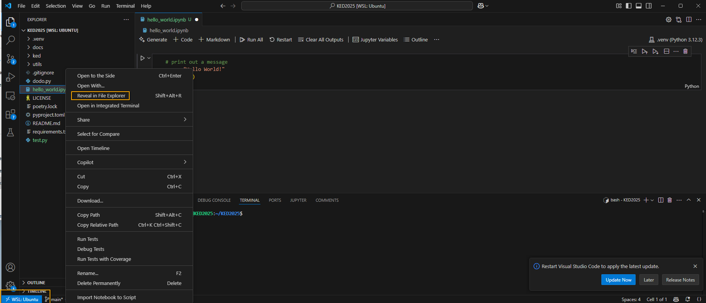

# Requirements {.unnumbered}

-   Deadline: 18 April 2025 (by midnight)

-   File format: Jupyter Notebook `.ipynb` or Python file `.py`

-   Naming schema: `surname_ked2025_assignment_2.ipynb` or `surname_ked2025_assignment_2.py`; Replace `surname` with your surname.

-   Submit your solutions on time via the respective exercise module on OLAT. The module is only open until midnight.

-   Find solutions individually. In terms of programming, Google and ChatGPT may be your best friends. Try to use ChatGPT as a virtual tutor if you struggle to understand something. When you get stuck, post your issue in the OLAT forum.

# Introduction {.unnumbered}

You learn how to analyze a book by counting all the words and their frequencies.

[Project Gutenberg](https://www.gutenberg.org/) provides an easy access to classic literature for which the copyright has expired. That makes it a great resource for conducting your first computational text analysis in Python.

Bonus steps are not mandatory. They offer additional opportunities to engage with the content of the course.

# Task 1: Get the data

Download a novel or play of your interest from Project Gutenberg with `wget` using your command-line. You may want to choose a book that you already know to complement this analysis with your existing knowledge.

1.  Select the book that you would like to analyze on <https://www.gutenberg.org/ebooks/> and go to the page of that book.

2.  Right-click on "Plain Text UTF-8" and "Copy link address" to download it later on.

3.  Open a command-line.

4.  Navigate to the folder `KED2025` using `cd` and create a subfolder with `mkdir` named `ked_assignment_2`.

5.  Navigate into the newly created subfolder and run `wget` followed by the link address of the book that you copied.

6.  Open the downloaded file in VS Code editor to check how your data looks like.
   
You don't need to include the commands for this task in your submission.

# Task 2: Analyze the data

Count all the words in your book using Python.

1.  Open VS Code and create a new notebook (`.ipynb`) in the same folder where you have downloaded the file from task 1.
2.  Do the steps below using Python code. A template covering the first 3 steps is provided below. For the other steps, check the lecture slides for relevant chunks of code. `TODO` parts in the provided code require adaptation.
    1.  Import the necessary modules at the top of your script. You may subsequently add more modules there as soon as you use them anywhere in the script. Don’t add modules that you never use.
    2.  Read the file that you downloaded in the task 1 into a variable.
    3.  Clean up the header and the footer of the file (i.e. information added by Project Gutenberg that is not part of the original book). You must still adapt the pattern for the header.
    4.  Lowercase the text.
    5.  Bonus: Restore lines and paragraphs. Ask ChatGPT how to join the lines while keeping paragraphs by prompting it with something like `python join lines keep paragraphs`.
    6.  Write the cleaned text into a new file.
    7.  Extract alphanumeric words without punctuation from the lowercased text.
    8.  Print the first 10 words.
    9.  Count all the words.
    10. Write the counted vocabular into a new file. One word and its frequency per line, separated by a tabulator.
3.  Open and inspect the cleaned file in VS Code. Does it look correct after the clean up? Check the header, footer, potential missing parts, lowercasing etc. If it doesn't look right, correct your code and rerun the steps above.
4.  Open the written vocabulary with its frequencies in a spreadsheet program (e.g., Excel or Numbers). When you cannot find the saved file, you can open its location via VS Code by right-clicking and selecting `Reveal in Explorer` (Windows) or `Reveal in Finder` (Windows). See screenshot below.
5.  Go back to the Jupyter notebook and create a separate markdown cell or create a comment starting with `#`. Answer the following questions briefly as bullet points:
    1.  What are the most frequent words?
    2.  Who of the main characters is mentioned the most?
    3.  Do the frequent words correspond with the main themes of the book?
    4.  Did you find something remarkable?



## Code Template

``` python
# import relevant modules
# TODO

# read text
infile = Path("TODO")
text = infile.read_text()

# replace the header with metainformation
# TODO: modify the pattern according to the name of your book 
text = re.sub(r"The Project Gutenberg.*TODO \*\*\*", "", text, flags=re.DOTALL)

# replace footer with terms and conditions
text = re.sub(r"\*\*\* END OF THE PROJECT GUTENBERG.*", "", text, flags=re.DOTALL)

# TODO: step 3 and following
```

# Test your script

This task is just a sanity check for your script. Restart the environment to remove intermediate objects (e.g., variables) and, subsequently, run your code in one go by following these steps:

1.  Click `Restart` in the menu bar at the top of the code.
2.  Click `Run All` next to it.

VS Code executes all the cells with code, one after another. Everything should be reconstructed accordingly and you should see a green tick below each cell. If not, correct the script so that it runs without any issue.

# Feedback

Briefly answer the following questions in a separate markdown cell or as a comment starting with `#`.

1.  Do you have any questions?
2.  How long did it take to solve this exercise? Give a fair estimation.