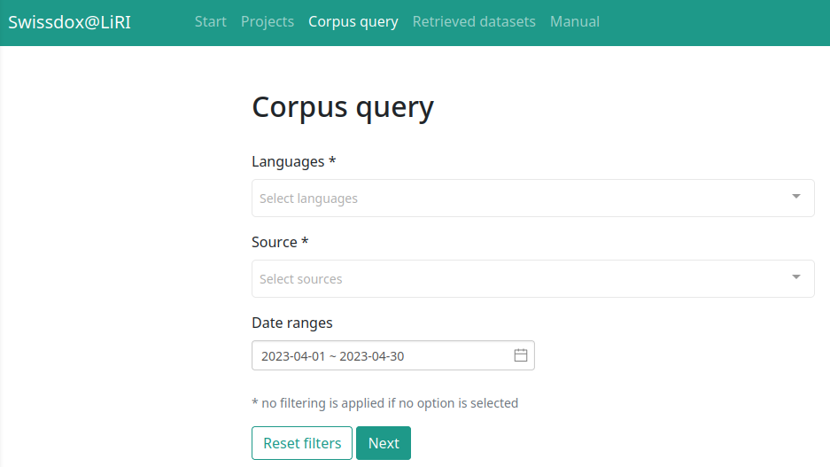

## Recap last lecture

-   introducing Python 🐍

-   learning programming concepts & syntax

    -   data types, loops, indexing, functions...

-   working with VS Code Editor

::: notes
-   praktische Anwendung von "trocken" eingeführten Elementen letztes Mal
-   Kern: Wie werden Daten repräsentiert und verändert in Python
    -   Variablen haben Datentypen
    -   Funktionen: wenn man die gleichen Arbeitschritte durchführen will.
        -   Abstraktion: ich muss mich gar nicht mehr um den genauen Inhalt dieser Funktion kümmern
-   VS Code mit Jupyter Notebooks
:::

## Outline

-   learn about available data sources
-   analyze and justify your own data
    -   any text ✅
    -   from anywhere ✅
    -   `.txt` or `.pdf` format ✅

::: notes
-   zweiteilige Sitzung
    -   Wo finde ich geeignete Datenquellen?
    -   Wie kann ich mit Python Text aus eigenen Daten extrahieren?
-   interessannte Datasets für die Sozialwissenschaften
    -   es gibt allerdings nicht viele
    -   zumeist eigene Daten präparieren
-   eigene Textdaten nutzen unabhängig von
    -   Formaten
    -   historischem Kontext (digital native)
:::

# Data sources {data-background-image="../images/text_data_mining.jpg"}

## What data sources are there?

-   broadly social
    -   newspapers + magazines
    -   websites + social media
    -   reports by NGOs/GOs
-   scientific articles
-   economic
    -   business plans/reports
    -   contracts
    -   patents

👉 basically, any textual documents...

::: notes
-   unheimliche Vielfalt an Dokumenten, alles neue digital
-   Textkollektion ist bereits vorhanden im Gegensatz zu Survey
    -   given data statt created data
    -   Datenbereinigungen sind nötig
-   hier nur einen Bruchteil vorgestellt, soll als Inspiration dienen
    -   Zeit reicht nicht, um auf alle Quellen einzugehen

[Image Credits](https://www.copyrightuser.org/understand/exceptions/text-data-mining/)
:::

## How does the data look like?

### Any text is data, yet some formats are more suitable.

1.  datasets like `.csv` 🥰
2.  plain text like `.txt` 🙂
3.  text in other formats like `.pdf` 😬

::: notes
-   Am liebsten Datensätze

    -   schön strukturiert in Zeilen und Spalten mit Metainformationen

-   txt ohne Metainformation, aber bereit für Analyse

-   PDF braucht Extraktionsschritt

    -   anfangs Seminar über proprietäre Daten gesprochen

-   manchmal steckt in Metainformation in Dateinamen (z.B Jahr)
:::

## Some great (historical) datasets

### `.csv` ready off-the-shelf

-   [1 August speeches by Swiss Federal Councilors](https://www.republik.ch/2019/08/01/anleitung-fuer-die-perfekte-ansprache-zum-1-august)
    -   provided via [course repo](https://github.com/aflueckiger/KED2025/blob/main/ked2024/materials/data/dataset_speeches_federal_council_2019.csv)
-   [Human Rights Reports by various NGOs](https://dataverse.harvard.edu/dataset.xhtml?persistentId=doi:10.7910/DVN/IAH8OY)
-   [United Nations General Debate Corpus](https://dataverse.harvard.edu/dataset.xhtml?persistentId=doi:10.7910/DVN/0TJX8Y)
-   [Corpus of Resolutions: UN Security Council](https://zenodo.org/records/11212056)
-   [Inaugural Speeches by US Presidents](https://www.kaggle.com/datasets/adhok93/presidentialaddress)
-   [NewsWire](https://huggingface.co/datasets/dell-research-harvard/newswire)
    -   2.7M US news articles, 1878-1977


<br>

😓 There are still not many.

::: notes
-   sehr wenige standardisierte Datasets
-   nicht wie bei Survey-Forschung (ESS), numerischer Daten aus Politik und Ökonomie
:::

## Dedicated search engines for datasets

### Use case: Search for existing datasets

-   [Harvard Dataverse](https://dataverse.harvard.edu/)
    -   open scientific data repository
-   [Google Dataset Search](https://datasetsearch.research.google.com)
    -   Google for datasets basically

<br>

👉 search for a topic followed by `corpus`, `text collection` or `text as data`

::: notes
-   fortschrittliche Wissenschaft veröffentlicht nicht nur Papers, sondern auch Daten und Code
-   computergestützte Textanalyse ist aber immer noch Nische
-   Suchmaschinen für Datensätze
-   allerlei Datensätze, primär aus Wissenschaft
:::

## Search techniques 🔍 {data-background="var(--green)"}

Make your (Google) web search more efficient by using dedicated [tags](https://support.google.com/websearch/answer/2466433?hl=en). Examples:

-   `"computational social science"`
-   `site:nytimes.com`
-   `nature OR environment`

::: notes
-   Quotes für Wörter die zusammen gehören
-   Summe von Wörter haben evtl andere Bedeutung
-   Boolean Search - OR / AND
:::

## [Swissdox](https://swissdox.linguistik.uzh.ch/): A game changer

### Assemble a news dataset and export as `.csv`

::: columns
::: {.column width="50%"}
-   over 250 Swiss [newspapers](https://liri.linguistik.uzh.ch/wiki/langtech/swissdox/core/source)
-   historical and updated daily
-   needs registration (free)
:::

::: {.column width="50%"}

:::
:::

::: notes
-   Plattform von UZH
-   Medienberichte eine der spannendsten Quellen für Analyse sozialer Phänomene
-   Perspektiven:
    -   Längsschnitt (historisch) und Querschnittdaten (Verlage)
    -   Schweizer Illustrierte seit 1911
-   Analyse von einem solchen Datensätzen nächste Woche
:::

## More publishers

-   [Project Gutenberg](https://www.gutenberg.org/) and [HathiTrust](https://www.hathitrust.org/datasets)
    -   massive collection of books
    -   open, HathiTrust requires agreement
-   [Nexis Uni](http://www.nexisuni.com/)
    -   international newspaper, business + legal reports
    -   licensed by the university
-   [Constellate](https://constellate.org/builder/)
    -   scientific articles of JSTOR across disciplines
    -   provides an easy dataset builder

👉 check out other resources licensed by [ZHB](https://www.zhbluzern.ch/recherche/e-medien)

::: notes
-   Nexis ähnlich Swissdox, aber international
-   Constellate
    -   kurze Demo von Constellate
    -   brandneue Platform - einfache Zusammenstellung von JSTOR Artikeln
    -   sehr gute Metadaten - auch gut für schnelle Recherchen ohne Download
-   Projekt Gutenberg
    -   Bücher mit abgelaufenem Copyright (\>70 Jahre)
    -   Download als txt
    -   Wieso Literatur? –\>Zeitgeist
    -   genderspezifische Sprache, Verweise Natur/Umwelt
    -   relevant für Assignment
:::

## Interesting sources as PDFs

### Any organization of your interest 👍

-   [Party Programmes across Europe](https://visuals.manifesto-project.wzb.eu/mpdb-shiny/cmp_dashboard_dataset/)
    -   covers over 1000 parties from 1920 until today in over 50 countries
-   [Swiss voting booklets](https://www.bk.admin.ch/bk/de/home/dokumentation/abstimmungsbuechlein.html)
    -   from 1978 until today
-   [Swissvotes](https://swissvotes.ch)
    -   collection of resources on Swiss public votings
-   [Curia Vista](https://www.parlament.ch/de/ratsbetrieb/suche-curia-vista)
    -   Swiss parliamentary debates
-   [1 August speeches by Swiss Federal Councillors](https://www.admin.ch/gov/de/start/dokumentation/reden/ansprachen-zum-nationalfeiertag.html)
-   [Nestlé Annual Reports](https://www.nestle.com/csv/performance/downloads)
-   [University of Zurich Annual Reports](https://www.archiv.uzh.ch/de/editionen/jahresberichte.html)

::: notes
-   Jahresberichte UZH seit 1913, durch Studierende entdeckt
:::

## Scraping PDFs from websites

### Use case: [Swiss voting booklets](https://www.bk.admin.ch/bk/de/home/dokumentation/abstimmungsbuechlein.html)

-   `wget` to download any files from the internet

``` bash
# get a single file
wget EXACT_URL

# get all linked pdf from a single webpage
wget --recursive --accept pdf -nH --cut-dirs=5 \
--ignore-case --wait 1 --level 1 --directory-prefix=data \
https://www.bk.admin.ch/bk/de/home/dokumentation/abstimmungsbuechlein.html

# --accept FORMAT_OF_YOUR_INTEREST
# --directory-prefix YOUR_OUTPUT_DIRECTORY
```

::: notes
-   jetzt Download automatisieren
    -   Vorteil: schneller systematischer Download & Dokumentation von Quellen
-   kurze Demo
    -   Rechtsklick für Linkadresse
    -   Haupt-URL angeben, wo PDF verlinkt sind
    -   nicht auf alle Argumente eingehen
-   Scraping von Blogs/Social-Media möglich über Python
    -   nicht Teil von Seminar
:::

# Data is no free lunch 😥

::: notes
-   Eigentum

-   Bias

-   Formate
:::

## Data is property 🚫

### ... and has rights too

-   copyrights may further limit access to high quality data
-   check the rights before processing data

{width="70%"}

::: notes
-   Zugang zu Daten nicht immer einfach
-   Datenbereitstellung oftmals Teil von Geschäftsmodell
    -   dann restriktiv
-   Creative Commons
    -   Beispiel: Wikipedia
    -   nur Attribuierung nötig
-   oftmals ist Verwendung nicht geregelt
    -   nutzt Graubereich
    -   Faustregel: was für Öffentlichkeit bestimmt ist, kann analysiert werden
:::

## Imperfect data: A tail of bias

-   noise in text

    -   non-content (e.g. table of content), inconsistent spelling

-   archive holes

    -   lost or uncollected data

-   selective corpus curation

    -   supposition that key-word(s) captures topic

-   social bias

    -   view from somewhere, stereotypes

<br>

👉 think about the data and mitigate issues

::: notes
-   non-content elements
    -   Metadaten, Kopfzeilen etc.
-   fehlende, selektive & verzerrte Daten
-   sozialer Kontext
    -   z.B. Budgetkürzung oder Neuausrichtung --\> Wegfall von Thema
    -   Sicht von weissen Männern auf Thema
:::

## . [A world for humans ...<br>... and a jungle of file formats.]{style="color:#0c0c0c;"} {data-background-image="../images/file_types.jpg"}

<!-- https://www.studio-24-7.com/file-formats-and-their-uses-explained/ -->

::: notes
-   extrem viele File-Typen
-   mühsam, aber es gibt einfache Tools für Umwandlung
:::

## Common conversions

### Your text is of a particular type

::: columns
::: {.column width="50%"}
⬇️

digital native documents <br>`.pdf`, `.docx`, `.html`<br>

⬇️

convert to `.txt`
:::

::: {.column width="50%"}
⬇️

scans of (old) documents <br>`.pdf`, `.jpg`, `.png`<br>

⬇️

Optical Character Recognition (OCR)
:::
:::

<br>

**machine-readable** ✅

::: notes
-   PDF ist Publikationsstandard
    -   digitale PDF vs Scans (Unterschied werden wir gleich anschauen)
    -   in manchen kann man nicht Suchen
-   anschliessend Schritte zur Umwandlung der wichtigsten Formate
-   Tools für Umwandlung kennen lernen
:::

## What data are you interested in?

### Think about your mini-project


::: notes
-   Je nach Datenquelle, Aufbereitung unterschiedlich aufwendig
-   nun alles da für Mini-Project, ausser wenn Lösung in Python
:::

## Assignment #2 ✍️

-   get/submit via OLAT
    -   starting tonight
    -   deadline: 19 April 2025, 23:59
-   discuss issues on OLAT forum

::: notes
-   Übung: Wörter zählen aus Buch von Projekt Gutenberg
-   Bash + Python
-   nicht bis zum Schluss warten
-   **Pause** (wichtig, damit genug Zeit bleibt für Coding)
:::

## Let's start [coding](https://github.com/aflueckiger/KED2025/blob/main/ked2024/materials/code/ked2024_07.ipynb) ✨

# Questions? {.white-text data-background-image="../images/paint-anna-kolosyuk-unsplash.jpg"}

## In-class: Exercises I {data-background="var(--blue)"}

1.  Make sure that your local copy of the Github repository KED2025 is up-to-date with `git pull`. Check out the data samples in `ked2024/materials/data` and the scripts to extract their text in `ked2024/materials/code`.
2.  Decide on one use-case that interests you most.
3.  **Apply the commands to reproduce on the given data. Test them on your own data. Check the resources. Ask questions. Think about your mini-project.**

## In-class: Exercises II {data-background="var(--blue)"}

1.  Use `wget` to download *cogito* and its predecessor *uniluAKTUELL* issues (PDF files) from the [UniLu website](https://www.unilu.ch/magazin/service/pdf-und-archiv/#section=c67079). Start with downloading one issue first and then try to automatize the process to download all the listed issued using arguments for the `wget` command.
2.  Convert the *cogito* and *uniluAKTUELL* PDF files into TXT files. You can use the code given for native, digital PDFs (no OCR needed). Try with a single issue first and then write a loop to batch process all of them.
3.  What is the University of Lucerne talking about in its issues? Use the commands of the previous lectures to count the vocabulary.
4.  Do the same as in 3.), yet analyze the vocabulary of *cogito* and *uniluAKTUELL* issues separately. Does the language and topics differ between the two magazines?