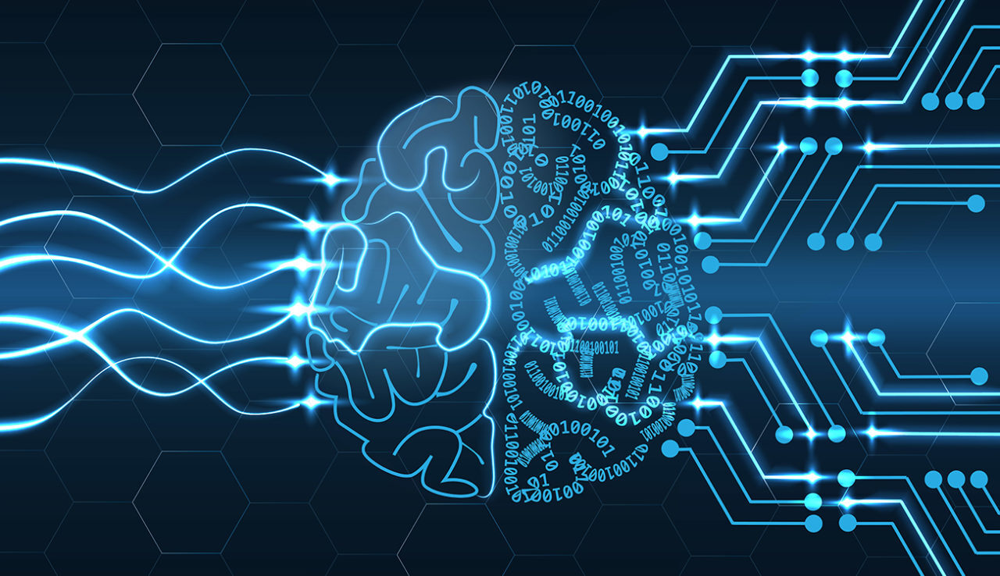
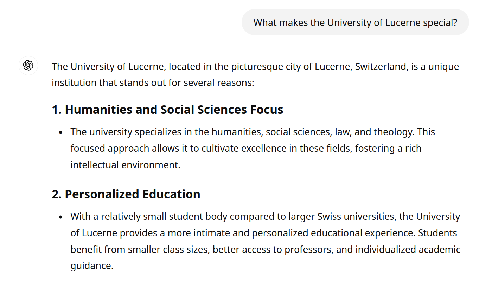
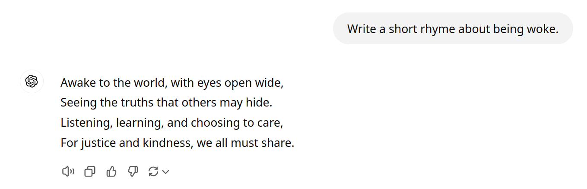
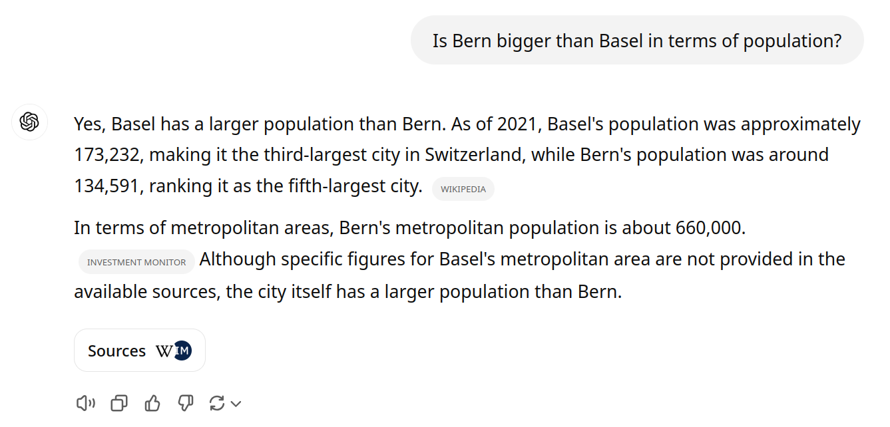
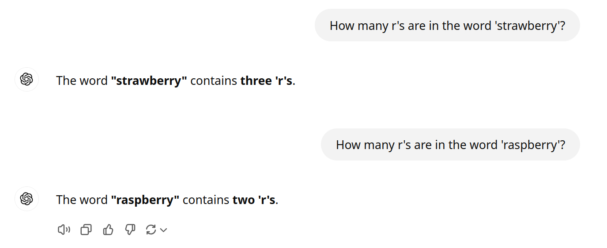

## Outline

1.  digital revolution or hype?
2.  about us
3.  goals of this course

::: notes
-   Dreiteilig
    -   Heranführung, Austausch, Kursorganisation
-   brandaktuelles Thema, öffentlicher Diskurs
-   Exkurs: Computer als Zaubermaschine vs. Werkzeug
    -   Was ist künstliche Intelligenz?
-   Erst dann Textanalyse im eigentlichen Sinne
:::

# AI: A non-standard introduction

## The world has changed, hasn't it?

::: r-stack
{.fragment width="80%"}

{.fragment width="80%"}

{.fragment width="80%"}

{.fragment width="100%"}
:::

::: notes
-   Welt im Wandel
    -   verheissungsvoll oder dystopisch (Weltherrschaft Roboter)
-   Einfache Google Suche nach "AI"
-   Wer kennt solche Bilder nicht?
    -   Roboter, Hybride, Hirne
    -   Blauton
    -   neuerdings: funky, vielfarben
    -   populärwissenschaftliches Bild reflektiert eher ein Gefühl denn Realität
-   AI ist hip: Technologiefirmen, Forschung, Konsumenten
:::

# **The era of AI:** <br> Big data, big government, big business

::: notes
-   AI scheint eine neue Ära einzuleuten mit gewaltigem Impact auf unsere Gesellschaft
    -   speziell auf Politik und Ökonomie
-   Begriff
    -   Big Data discredited due privacy concerns (NSA, Facebook etc.)
    -   Neuer prägender Begriff ist AI, Big Data ist aber Voraussetzung dafür
-   Mithilfe von AI Aufgaben lösen und Dinge lernen, die wir ohne nicht geschafft hätten
:::

. . .

**... and big empowerment**

## Group discussion {data-background="var(--blue)"}

**What makes a device looking intelligent?**

::: notes
-   device == computer?
-   Diskussion bevor ich meine Perspektive einführe (5min)
    -   Sind diese Dinge intelligent: automatische Türe, Schachcomputer, DeepL, Roboter?
    -   Wer braucht Siri/Alexa/ChatGPT?
-   Intelligenz nichts Absolutes, relativ zu Menschen
    -   von Schachspielen (intelligente Menschen) zu Lernen
    -   Generalisierbarkeit neustes Paradigma
-   Gewöhnungseffekt: "AI is whatever hasn't been done yet." D. Hofstadter
:::

. . .

::: answer
AI is a moving target with respect to ...

-   human capabilities
-   technological abilities
:::

## Transfer of human intelligence 🤖

### from static machines to more flexible devices

-   mimicking intelligent behavior
    -   perception: reading + seeing + hearing
    -   generation: speaking + writing + drawing
    -   moving in the physical world
-   flexibility and contextual adaptability
-   reproducing any media form

::: notes
-   Referenzfolie Mensch
    -   Imitieren von menschlichen Sinnen und Ausdrücken
    -   Sprechen/Sehen/Hören/Zeichnen
    -   Bewegen scheint nur in Kombination mit Sehen relevant
    -   Statische Maschine
        -   if this then that
        -   Vorhersehbarkeit
    -   Kontextabhängiges Wahrnehmen/Handeln
        -   Interaktion initiieren
        -   Situationsangepasstheit
-   Video/Foto Generierung nicht mehr angelehnt an Mensch, sondern an ökonomisch-motivierte Reproduktion von allen Medienformen
-   Eindrückliche Beispiele, Stand Forschung
    -   noch überraschend?
    -   Forschung/Produkt stark zusammengerückt
:::

## Seeing like a human?

 [@Wu2019]](../images/facebook_detectron2.png){.center width="60%"}

::: notes
-   Lass uns beim Sehen beginnen
-   Auschnitt von Objekterkennung & Klassifizierung
-   ontologische Frage
    -   Mensch nur als Ganzes, ohne Erkennung von Kleidern oder Körperteilen
    -   Person ohne Geschlecht?
-   Keine naturgegebene Ordnung oder technologische Notwendigkeit, sondern in Code/Daten gegossene Entscheidungen
:::

## Hearing and speaking like a human?

-   Speech-to-Text 💬

    -   robust understanding complex environments (e.g. language, accent, noise) [@Radford2022]

-   Text-to-Speech 📣

    -   respect emotions beyond correct pronunciation
    -   [clone your voice](https://huggingface.co/spaces/OuteAI/OuteTTS-0.3-1B-Demo)

-   Speech-to-Speech 🗣️

    -   [speech translation](https://seamless.metademolab.com/expressive/) [@Duquenne2023]

::: notes
-   Transkription von Gesagtem zu Text
    -   daran gewöhnt, aber vor allem an Dinge, die schlecht funktionieren
    -   jetzt robuster und sogar für Schweizerdeutsch robust
-   alle möglichen Richtung: Text zu Audio oder Stimme zu Stimme
    -   nicht nur beliebige Stimme, sondern eure eigene
    -   Personalizing voice given an audio sample of 10s
-   Produkte: Computersteuerung, Live-Übersetzung und Protokollierung von Gesprächen
:::

## Simulating (multiple) humans?

### Beyond linear conversations

::::: columns
::: {.column width="65%"}
-   [Generate interactive podcasts](https://notebooklm.google.com) based on any text

-   [Generate a songs](https://x.com/i/status/1737518588159041845) following instructions
:::

::: {.column width="35%"}

:::
:::::

::: notes
-   NotebookLM aka research assistant

    -   hilfreich fürs Studium für das Verstehen vom Paper
    -   summarization, conversation, answering questions, join the conversation
    -   neue, spielerische, informativer Auseinandersetzung mit Text
:::

## Outsmarting humans?

::: r-stack
{.fragment .fade-in-then-out}

{.fragment .fade-in-then-out width="1359"}

{.fragment .fade-in-then-out}

{.fragment .fade-in-then-out}

{.fragment .fade-in-then-out}
:::

::: notes
-   ChatGPT: Elefant der im Raum steht
-   Wer nutzt ChatGPT?
    -   release 11.2022 und dann in kurzer Zeit zu Mainstream
-   GPT als Informationsquelle
    -   UniLu: könnte glatt auf die Website, hat mittlerweile 6 Fakultäten
    -   konzise Listen statt Fliesstext –\> neues Textformat
-   GPT für kreatives Schreiben und Planen
    -   Reim, Start/Schreibhilfe, Ferienplanung
-   GPT als Informationsquelle ist risikoreich
    -   letztes Jahr war Städtefrage komplett falsch
    -   nun richtiges Reasoning, allerdings falsche Antwort
    -   Integration Web-Search mit Quellenangaben seit Dezember 2024
-   GPT generiert aber auch Bullshit
    -   Problem: Man weiss nicht was Bullshit ist und was nicht
:::

## Debunk some myths around [ChatGPT](https://chat.openai.com/)

::: incremental
-   is a brand, **large-language models (LLM)** is the technology

-   generates fluent text, **not necessarily truthful**

-   is highly **useful**, although it understands little

-   what is tough for humans **might be easy for a model**; and vice-versa

-   is **English**-focused, multi-linguality is limited

-   generates **non-reproducible** outputs

-   generated text **cannot be detected** (except verbatim parts)

-   yesterday's **version** might be different from today's

-   **open-source** is chasing OpenAI and the other Sillicon Valley giants
:::

::: notes
-   Viel Halbwissen zu Chatbots
-   LLM/Transformer is the technology
-   Halluzinierungen: Dinge klingen plausibel, sind aber faktisch falsch
    -   Plausibel heisst nicht zwingend korrekt
:::

## Where does the smartness come from?

### Number of words exposed

-   \~100'000'000 for a typical 13-year old kid [@Timiryasov2023]
-   \~4'300'000'000 words in entire Wikipedia
-   \>15'000'000'000'000 for current LLMs 🤯 [@Grattafiori2024]

::: notes
-   trainiert auf 15 Trillionen Wörter
-   Technisch
    -   Kompression des Internet abzüglich Filterung
    -   Predict next word
-   Mehr in separater Sitzung zu modernen Sprachverarbeitung
-   vorhersehbare Evolution statt AI-Revoultion über Skalierung Daten
    -   Dooms-Day Szenario nicht angebracht
:::

## An LLM is amazing but ...

### ... it is also a stochastic parrot. 🦜

### [@Bender2021]

::: notes
-   Plappert im Stile des Trainingsmaterial
-   Gibt auch Antworten, wenn es dafür keine genügende Evidenz gibt (da pur statistisch)
:::

## The LLM apocalypse

### A post-apocalyptic take on education [@Mollick2023]

-   chat bots are another tool like Google Search
-   chat bots are your personal tutor
    -   productivity tool to become faster and better
    -   helping you to think, not replacing thinking
    -   don't trust blindly
    -   be transparent

**LLMs are a tool, learn how to use it 👍**

::: notes
-   Chat bots hat nicht nur verschiedene Unternehmen, sondern auch das Bildungssystem in Krise gestürzt
-   keine Ahnung, was in anderen Kursen gilt
    -   Verbieten ist keine Option, niemand würde Google Search verbieten
-   ChatGPT wird sich etablieren genauso wie Google Suchmaschine
    -   Nutzungskompetenz ist wichtig
-   Tutor
    -   Diskussionspartner
    -   grosses Potential für individualisiertes Lernen
    -   braucht es!
    -   Nutzung transparent machen
:::

## The future of search

::::: columns
::: {.column width="65%"}
-   chat bots challenge search engines

    -   combine search and generation

    -   generate direct answers with source attribution instead of text snippets

    -   [Microsoft Copilot](https://www.bing.com/search?q=Bing+AI&showconv=1&FORM=hpcodx), [Google Gemini](https://gemini.google.com/app), [you.com](https://you.com/?chatMode=default)

-   agents pursuing more complex tasks

    -   chat bots are an interface rather than a single model
:::

::: {.column width="35%"}
](../images/search_engine_you_2025.png){width="80%"}
:::
:::::

::: notes
-   Integration von Suchmaschinen in LLM

    -   Zugang zu Web: Kombination von klassischer Suche + LLM für Zusammenfassung der Resultate

-   harter Wettbewerb

    -   Google 100 Mrd Verlust am Aktienmarkt nach unglücklichem LLM-Launch
    -   zurück an Spitze

-   Antworten heisst Generieren!

-   Trend zu Agent-based modeling

    -   Plattformen basieren nicht auf einem einzelnen Modell, es ist eher eine Schnittstelle zu mehreren Modellen
    -   Chat bot kombiniert dann alle Teilschritte zu finaler Antwort
:::

# Trends towards generative and multimodal AI

::: notes
-   2 deutliche Trends
    -   Generieren und beliebige Medienformen
-   Generieren statt nur Klassifizieren
    -   nicht nur Katze/Hund identifizieren, sondern gleich Bild generieren
    -   passive vs. aktive Rolle von AI
    -   Chat verbindet "Verstehen" + Generieren
-   Generieren beschränkt sich nicht auf Text
    -   Zusammenbringen von mehreren Medien/Modalitäten
    -   intensive Forschung Generieren von Text, Bild, Video
:::

## These people do not exist

### Generated Images by a neural network [@Karras2020]

. Generate [more](https://thispersondoesnotexist.com/) faces!](../images/ffhq_latent.gif)

::: notes
-   beliebiges Generieren photorealer Gesichter durch Computer
:::

## Multimodality and guidance

### Guided generation of text, audio, images, video

Prompt: `Elephant amigurumi walking in savanna, a professional photograph, blurry background`

![State-of-the-Art image generation model Imagen3. [@Imagen-Team-Google2024] <br>Use [on Gemini platform](https://gemini.google.com/app).](../images/imagen3_elephant.jpg)

::: notes
-   Zufällige Generierung ist nicht genug
-   Kontrollierbarkeit/Zielgerichtetheit des Inhalts/Styls
    -   Wie soll etwas aussehen?
    -   Text zur genaueren Spezifizierung
    -   durch Sprache neue, sehr eigenwillige (!) Bilder generieren lassen
-   Revolution: Interaktion mit Computer über "natürlich-sprachlichen" Dialog
    -   promp engineering
:::

## Adapt images using text prompts

-   [Generate](https://deepmind.google/technologies/imagen-3/) [@Imagen-Team-Google2024]
-   [Edit](https://emu-edit.metademolab.com/#emu-edit-in-action) [@Sheynin2023]
    -   e.g. virtual [try-on of clothes](https://huggingface.co/spaces/Kwai-Kolors/Kolors-Virtual-Try-On)
-   [Enhancing](https://huggingface.co/spaces/finegrain/finegrain-image-enhancer)
-   [Explain](https://huggingface.co/vikhyatk/moondream1)

![Editing pictures with Muse using natural language [@Chang2023]](../images/muse_picture_edit.jpg)

::: notes
-   Möglich sind nicht nur kontrolliertes Generieren, sondern auch kontrolliertes Verändern
-   einfache Bildmanipulation mit grossem Potential und Risiken
-   Business-Möglichkeiten
    -   Zalando-Kleider virtuell anprobieren oder Wohnung einrichten
-   https://huggingface.co/spaces/Xenova/remove-background-web
:::

## Erase or edit reality

### For your Instagram or fake politics

](../images/magic_eraser.gif)

::: notes
-   Nicht Zukunft, sondern Praxis!
-   Für Instagram ganz nett, aber auch mit gesellschaftlichen Konsequenzen
-   Deepfakes
    -   Bildmanipulation gabs schon im analogen Zeitalter (z.B. Stalin), aber "Photoshop" wird einfacher
    -   reales Bild unter falschem Kontext ist immer noch die am weitesten verbreitete Fake-News
-   Problematisch für
    -   Persönlichkeitsrechte
    -   Journalismus und historische Forschung
:::

## From image to video generation 🎥

### Synthesize any content with ever increasing quality

::::: columns
::: {.column width="60%"}
-   use words and images to synthesize videos [@Bar-Tal2024; @Brooks2024]
    -   [Veo 2](hhttps://deepmind.google/technologies/veo/veo-2/) constitutes the current research frontier
-   [real-world dubbing](https://www.youtube.com/watch?v=iQ1OPpj8gPA) for movies
:::

::: {.column width="40%"}

:::
:::::

::: notes
-   Video als heiliger Gral Last Resort? -\> Nein
-   Qualität ist nicht perfekt, aber es ist extrem schnelle Entwicklung im Gange. Unterschätzung ist nicht angebracht
-   Problem: Es gibt kein manipulationssicheres Medium mehr. Es kann alles generiert werden: Bilder, Audio, Video, Texte

https://www.latimes.com/entertainment-arts/business/story/2022-12-19/the-next-frontier-in-moviemaking-ai-edits
:::

## Real-time, multimodal interaction

### Fusing the digital and the physical world 👀👂🧠

Interact with Google's [Gemini](https://aistudio.google.com/live) using text, voice, video, or screen sharing

::: notes
-   all diese Modalitäten sind Voraussetzung für Roboter

-   Roboter sind sozusagen Endstufe, aber für viele Dinge braucht es keine physischen Artefakte

-   **Pause**
:::

## Artificial Intelligence (AI)

### (Converging) Subfields

-   Natural Language Processing (NLP)
-   Computer Vision (CV)
-   Robotics 🤖

::: notes
-   Von der Anwendungsseite zum technisch-wissenschaftlichen Teil
-   in Wissenschaft primär drei Felder
-   Felder sind nahe zusammengerückt
-   sehr viel gemeinsam in Methodik: Lernen von Daten
:::

## How does computer intelligence work?

-   concepts with overlapping meaning
    -   Artificial Intelligence (AI), Machine Learning (ML), **Deep Learning** (DL)
-   learn **patterns** from lots of data
    -   more recycling than genuine intelligence
    -   theory agnostically
-   supervised **training** is the most popular
    -   learn relation between input and output

{.l-image-corner height="60%"}

::: notes
-   Wie funktionieren diese Systeme?
-   AI-Paradigma: Logik vs. Lernen
-   DL = dominantes ML-Modell
    -   schichtweise Abstraktion
    -   unzureichende Metapher Hirn (Neuron trägt zur Konfusion bei)
-   Lernen von Unmengen Daten
    -   Input-Antwort-Beziehung
-   Regression = ML

[Related concepts](https://www.intel.com/content/www/us/en/artificial-intelligence/posts/difference-between-ai-machine-learning-deep-learning.html)
:::

## AI is different from Human Intelligence 🤖 {.center data-background-image="../images/array_of_numbers.png"}

::: notes
-   Tendenz zur Anthropomorphisierung
-   Maschinelle Intelligenz ist etwas ganz anderes menschliche Intelligenz
-   manche Dinge für Computer schwierig, für Menschen einfach (und umgekehrt)
-   Schach einfach für Computer, Lernen aus Fehler ohne Haufen neuen Daten schwierig
:::

## AI is also hype 📣

``` python
AI = from humankind import solution
```

::: notes
-   Wir unter/überschätzen AI zugleich
    -   Wer denkt Entwicklung verstanden zu haben, hat sie nicht verstanden
    -   grossen gesellschaftlichen Einfluss: positiv/negativ
    -   Was uns aktuell fasziniert, ist dass AI nun auch Neuigkeit/Kreativität automatisiert
-   Systeme haben spezifisches Anwendungssgebiet und keine Autonomie
    -   wenn Zwecke für Menschen wenig definiert sind, wird es auch für Computer schwierig
    -   Mehrstufige Planung/Strategie/Verhandlung/Zweck von sozialen Prozessen statt nur Game (Vermeidung GameOver)
    -   Probleme mit Generalisierung, Performance hängt von Task familiarity ab und nicht von Task complexity
-   Weg zu AGI ist weiterhin unbekannt
    -   keine Angst vor Computer, die Welt übernehmen
    -   schon gar nicht als Roboter
:::

## Looking beyond the technology

### trends in AI

-   **smarter:** ever more powerful

-   **cheaper**: intelligence is getting commoditized

-   **democratized (?):** open vs closed models

-   **competitive:** geopolitical rivalry

-   **unecological:** raising ecological costs

    -   Jevons Paradox: increased efficiency offset by increased demand [@Luccioni2025]

::: notes
-   Neben dem Hype gibt es aber auch relative klare Trends

-   all das könnte man soziologisch untersuchen

-   im Seminar wollen wir aber selber den methodischen Werkzeugkasten der CS erlernen
:::

# Why this matters for<br>Social Science

## Computational Social Science

### data-driven research

-   computational social science [@Lazer2009; @Salganik2017; @Lazer2021]
    -   Digital Humanities, Computational History, Data Science
-   new, interdisciplinary approaches to long-standing questions
-   machine learning empowers researchers [@Lundberg2022]
-   early computational history already in 1960s [@Graham2015]

::: notes
-   Wieso zeige ich all das in sozialwissenschaftlichem Kurs?
    -   AI Spitze von Eisberg
    -   Pointe: Data-driven applications + research (!)
    -   Paper CSS Manifesto
-   Daten
    -   Modelle sind nur die halbe Miete, Daten sind der Zauberstoff.
    -   Research: Nicht neuste ML, sorgfältiges aggregieren
-   Sozialwissenschaften müssen sich bewegen
    -   CSS löst Problem sinkender response-rate in Survey
    -   alternative Datenquellen
    -   Auswirkungen Forschung, Fragestellung, Ausbildung
-   CSS mit langer Vorgeschichte, nie Mainstream
:::


## About the mystery of coding

### coding is like...

-   cooking with recipes
-   superpowers

... to tackle complex problems on scale :magic_wand:

::: notes
-   moderne Datenauswertung braucht Coding-Skills
    -   Coding ermöglicht Verarbeitung von vielen und komplexen Daten
-   2 Metapher für Abarbeiten von Befehlen
    -   Code wie Kochrezept
        -   Rezept, sehr genau, jeder Schritt exakt dokumentiert, ohne Interpretationsspielraum
        -   produziert stets das gleiche Resultat
    -   Superkraft: Küchenmaschine kommt quasi gleich mit
:::

## Everyone can aquire coding powers! {.center data-background="https://media1.tenor.com/../images/93c9eb756df19748e4fb50f04c4a451c/tenor.gif?itemid=11586724"}

::: notes
-   weniger Frauen in IT ist trauriger Fakt
-   gewachsen auf historischen Stereotypen
:::

# About us

::: notes
-   Studium? Wie viele Semester?
-   Programmiererfahrung? R, Python oder Kommandozeile
:::

## Personal example {.center data-background-image="../images/ma_flueckiger_country_mentions_black.jpg"}

[directed country mentions in UN speeches]{style="color:silver"}

::: notes
-   UN-Debatte: Wer erwähnt wen in Rede?
    -   Aufmerksamkeiten
    -   Extrahiert aus Texten
-   Farben/Ordnung nach Kontinent
-   Rolle der USA (Regenbogen)
-   Erkenntnisse
    -   Regionale Aufmerksamkeit statt Globalität
    -   Allianzen und Feindschaften
:::

# Goals of this course 🎯

## What you learn

-   collect and curate **data**
-   **computationally analyze**, interpret, and visualize **texts**
-   **digital literacy** + scholarship
-   problem-**solving** capacity

::: notes
-   ganzer Arbeitsprozess von PDF bis zur Visualisierung
-   Text als Datenform → Textanalyse
-   technisch: CL + Python Sprachen
-   Tools/Arbeitsweisen für Alltag/Forschen/Arbeit
    -   Leben vereinfachen
    -   Dinge, die ich spät gelernt habe
-   Problemlöseverhalten
    -   Nachlesen & Ausprobieren
:::

## Learnings from previous courses

-   too much content, too little **practice**
-   programming can be overwhelming
-   **learning** by **doing**, doing by **googling (ChatGPT?!)**

::: notes
-   eigene Erfahrung als Studi und Tutor
-   Zu ambitioniert + an Bedürfnissen vorbei
-   zu einseitig Programmieren
-   braucht viel Übung
-   Kein Einzelfallwissen, sondern Selbsthilfe
-   learn by example
    -   Doing is often better than thinking of doing
:::

## Levels of proficiency

1.  **awareness** of today's computational potential
2.  **analyzing** existing datasets
3.  **creating** + analyzing new datasets
4.  applying advanced **machine learning**

::: notes
-   Kompetenzstufen
-   Computer nicht nur Word + Youtube, sondern auch Werkzeug
-   Ziel: Stufe 3
:::

## How I teach

-   computational **practice**
-   **critical perspective** on technology
-   lecture-style introductions
-   hands-on coding sessions
-   discussions + experiments in groups

::: notes
-   Aufbau Unterricht
-   Seminar heisst interaktiv
-   Mix zwischen Vorlesung, Diskutieren & Experimentieren
:::

## Provisional schedule

| Date             | Topic                                           |
|------------------|-------------------------------------------------|
| 20 February 2025 | Introduction + Where is the digital revolution? |
| 27 February 2025 | *no lecture (Fasnacht)*                         |
| 06 March 2025    | Text as Data                                    |
| 13 March 2025    | Setting up your Development Environment         |
| 20 March 2025    | Introduction to the Command-line                |
| 27 March 2025    | Basic NLP with Command-line                     |
| 03 April 2025    | Introduction to Python in VS Code               |
| 10 April 2025    | Working with (your own) Data                    |
| 17 April 2025    | Data Analysis of Swiss Media                    |
| 24 April 2025    | *no lecture (Osterpause)*                       |
| 01 May 2025      | Ethics and the Evolution of NLP                 |
| 08 May 2025      | NLP with Python                                 |
| 15 May 2025      | NLP with Python II + Working Session            |
| 22 May 2025      | Mini-Project Presentations + Discussion         |
| 29 May 2025      | no lecture (Christi Himmelfahrt)                |

::: notes
-   12 Sitzungen, vorläufiger Plan
-   Was bedeutet Text als Daten zu analysieren?
-   Gemeinsame Installation → immer wieder Probleme
-   Computer Grundlagen + Kommandozeile
-   Python
-   Daten
-   Sitzung mit aktueller NLP und Ethik
-   Mini-Projekt
-   Inputs von Studierenden willkommen
:::

## TL;DR 🚀 {data-background="var(--green)"}

You will be tech-savvy...

...yet no programmer applying fancy machine learning

::: notes
-   Kein ML, aber solide Analyse
-   Empirische Arbeiten schreiben
-   bereits sehr effektiv und toll
:::

## Requirements

-   no technical skills required :white_check_mark:
    -   self-contained course
-   laptop (macOS, Win11, Linux) :computer:
    -   update system
    -   free up at least 15GB storage
    -   backup files

## Grading ✍️

-   2 assignments during semester
    -   no grades (pass/fail)
-   mini-project with presentation
    -   data of your interest
    -   backup claims with numbers
    -   work in teams
-   optional: writing a seminar paper
    -   in cooperation with Prof. Sophie Mützel

::: notes
-   Seminar üblicherweise mit Vorträgen
    -   Hier: 2 Übungen + Paper + Mini-Projekt
-   Denkt über Daten nach → mehr Spass, wenn Interesse daran
-   Auseinandersetzung fördern, keine harte Beurteilung
-   Teamarbeit
-   Kollaboration Mützel
:::

## Organization

-   seminar on Thursday from 2.15pm - 4.00pm
    -   additionally, streaming via Zoom
-   course website [KED2025](https://aflueckiger.github.io/KED2025/) with slides + information
-   readings on [OLAT](https://lms.uzh.ch/auth/RepositoryEntry/17335387816/CourseNode/79952613783583)
-   communication on [OLAT Forum](https://lms.uzh.ch/auth/RepositoryEntry/17335387816/CourseNode/91271815676815)
    -   forum for everything except personal
    -   subscribe to notifications
    -   direct: [alex.flueckiger\@doz.unilu.ch](mailto:alex.flueckiger@doz.unilu.ch)

::: notes
-   Präsentation/Daten über Kurs-Website
    -   zeigen
-   Forum für Fragen, Benachrichtigung einrichten
-   Papers OLAT
-   Abmelden vom Seminar
:::

## Registration via UniPortal

🚨 Registration period: 3 February – 9 March 2025 🚨

## Assignment #1 ✍️

-   get/submit via OLAT
    -   starting tonight
    -   deadline: 28 February 2025, 23:59
-   discuss issues on OLAT forum

::: notes
-   kleine Übung zu ChatGPT und LLMs
-   nicht bis zum Schluss warten
:::

# Course website


::: notes
-   Website durchsehen
:::

# Questions? {.white-text data-background-image="../images/paint-anna-kolosyuk-unsplash.jpg"}

## References {.allowframebreaks}