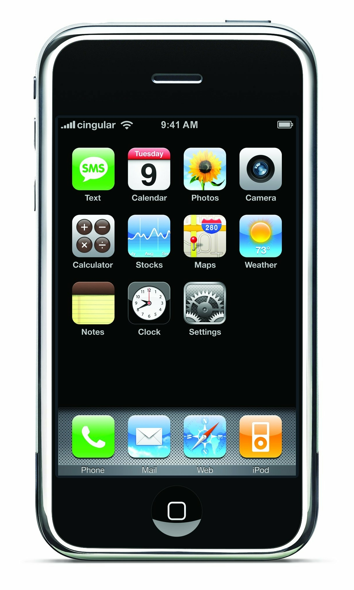
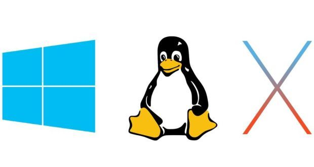
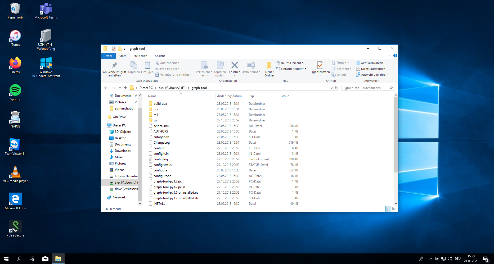
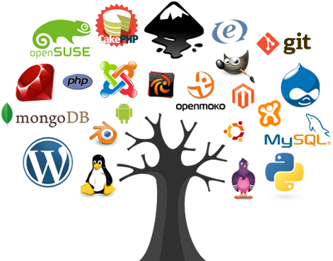

## Outline

-   recap + discuss paper 📑
-   interacting with computers 🪄
-   installation of programs 🔨

::: notes
-   Paper das für moderne Sozialwissenschaften argumentiert
-   Grundverständis für Mensch-Maschine-Interaktion
    -   Abriss über Computergeschichte
-   Installation
    -   abschliessen/Fehler beheben
    -   Zeitplan für Installation schwierig abzuschätzen
    -   Feierabend wenn System läuft
:::

## Recap last lecture

-   textual data is challenging 🤯
-   machine-readable data 🚧
-   reproducible research using computational approach ♻️

::: notes
-   Schwierigkeit bei Textanalysen
    -   Bedeutung ist kontextabhängig und unscharf definiert (gross/klein Maus/Elefant)
    -   Unvergleichbarkeit diskreter Symbole
-   Ziel: Abstraktion + Kontextualität kombinieren
    -   Quali + Quanti
    -   Generalisierung + Rekontextualisierung
-   Fragen
    -   wichtigste Dateiformate?
        -   txt, csv, tsv (xml)
    -   Sinn von offenen, maschinell lesbaren Formaten?
        -   keine Formatierung
-   Reproduzierbarkeit: durch code und Daten
-   Wem das philosophisch war: Keine Angst es wird technischer
:::

## Reading {data-background="#3c70b5"}

**Computational Social Science [@Lazer2009]**

. . .

-   data-driven
-   network analysis + text analysis
-   historical perspective vs. real-time dynamics
-   issues: limited access to data and new methods

::: notes
-   Manifest zu datenintensiven Sozialwissenschaften, Vergleich zu Biologie/Physik
-   more than self-reported data (survey)
-   Schwierigkeiten
    -   Mainstream-Methodik nicht für riesige Datenmenge ausgelegt
    -   Zugang zu Daten schwierig
        -   organisationsintern Daten und Datenschutz
-   historische und textuelle Daten einfacher zugänglich
-   methodical focus because of Nature Paper
:::

# Computers 💻

::: notes
-   Nun kennen wir die methodische Grundlage und haben darüber gesprochen, wieso CSS relevant ist

-   nun können wir uns dem Computer als Tool zuwenden
:::

## Two trends in computing

::::: columns
::: {.column width="70%"}
-   everyday, mobile, cloud-centered, touch/click-based approach
    -   single-purpose application
    -   smartphones, smart assistants, augmented reality
-   engineering, open-source, machine-oriented approach
    -   powerful due to modularity
    -   workflow for data science

[see also @Healy2019]
:::

::: {.column width="20%"}

:::
:::::

::: notes
-   Computer haben sich massiv verändert -\> am meisten an Benutzeroberfläche
-   Es gibt Spannungsfeld zweier Trends: Consumer vs Engineering
    -   erster Trend kennen wir alle (exemplarisch iPhone)
    -   zweiter Trend wollen wir lernen
-   Consumer
    -   radikale Einfachheit
    -   Apple als Pionier: GUI/Bedienung Angleichung an physische Welt, VR als Weiterentwicklung
    -   technisches Fundament ist wegabstrahiert (keine Dateiformate, Dateisysteme ersichtlich)
    -   Eingeschränktheit; nur machen, was vorgesehen ist; kein Zusammenspiel zwischen Apps
-   Engineering
    -   Flexibilität, Transparenz, Effizienz
    -   schwieriger Einstieg/Lernen, dafür sehr viel effektiver/vielseitiger
    -   ist alternativlos für Standardisierung unstandardisierter Daten
-   von Wissen/Tools der Engineers profitieren
    -   nicht selber Tools bauen
    -   effiziente Arbeitsabläufe + Modularität
:::

## Operating Systems (OS)

### Between hardware and applications

-   Microsoft Windows
-   macOS
-   Linux-based systems 🤓

{height="4cm"}

::: notes
-   Betriebssysteme sind das Software-Fundament
    -   übernehmen Interaktion zwischen SW und HW
-   Windows = Standardsystem, Alltag
-   Linux = stable, secure, free, innovative. Became more user-friendly, sometimes still issue
-   Mac = restricted to Mac HW, Unix-Derivat, vereint beide Welten
-   Betriebssysteme wie Fahrräder, für bestimmtes Gelände/Nutzung ausgelegt
-   Systeme gleichen sich immer mehr an
    -   Installation von Linux in Windows
:::

## User Interfaces (UI)

::::: columns
::: column
### Graphical User Interface (GUI)

:::

::: column
### Command Line Interface (CLI)

:::
:::::

::: notes
-   historisch nur CLI zur Computersteuerung
-   GUI von Apple entwickelt 1984, in 90er Standard
    -   Browsing ohne GUI nicht lustig
-   CLI ist mehr als Sentimentalität
    -   Lernen von Engineering-Prinzipien und Grundlage fürs Programmieren
    -   automatisierbar, schneller, auf Server einzig mögliche Interaktion
:::

## «An awesome programmer saves the world» {.white-text data-background="https://media.giphy.com/media/AOSwwqVjNZlDO/giphy.gif"}

::: notes
-   CLI auch in Popkultur, allerdings falsch dargestellt
:::

## Human-Machine Interaction

### Tell the computer efficiently :dart:

-   text commands instead of clicks
-   programming similar to human languages
    -   syntax (form)
    -   semantics (meaning)
-   computers are literalists

::: notes
-   Automatisierung über GUI nicht möglich
    -   statt "hier" klicken, einfach Skript
-   viele verschiedene Programmiersprachen
-   für Menschen ist Syntax zweitrangig, für Computer nicht
    -   Syntax sehr restriktiv (Rechtschreibefehler etc. nicht erlaubt)
    -   Computer sind ziemlich doof, aber sehr gehorsam.
    -   Machen genau, was man ihnen sagt, nichts mehr, nichts weniger. Nie.
:::

## Programming

-   command languages
    -   Bourne-Again shell (Bash), since 1989
-   programming languages
    -   Python, R, Java, C++ etc.
-   instructions → program ≡ algorithm
    -   analogous to cooking

::: notes
-   CLI primär für Dateimanipulation/Verarbeitung
-   Python
    -   einfach: reduziert auf das elementare
    -   Python is a general-purpose language whereas R is a statistical programming language.
-   Software wird neuerdings Algorithmus genannt
    -   falsch: "Algo als Böses/Mystisches"
    -   korrekt: schrittweise Umwandlung von Input zu Output
    -   software = program + data (complement HW)
:::

## Package manager 📦

### App stores for engineers

-   automation of software installation

    -   system: apt, Homebrew
    -   Python: pip, poetry, conda

-   packages have dependencies

::: notes
-   Paket Manager sind wie App Stores
    -   zentrale Verwaltung installierter SW
    -   älter
    -   umfangreicher
-   SW baut auf weiterer SW auf
    -   keine vollständigen Programme
    -   bei Installation hunderte von Kompatibilitäts-Checks
-   2 Manager: systemweit, Python
:::

## Open-Source is a mindset

### Standing on the shoulders of giants

-   free + open software
-   cross-platform portability
-   collaboration
    -   share + reuse
-   helpful community

{.l-image-corner height="50%"}

::: notes
-   wir nutzen ausschliesslich open-source
-   nicht nur gratis, sondern Code frei einsehbar und modifizierbar
-   Zusammen erreicht man mehr, schafft aber Abhängigkeiten
-   Abhängigkeiten funktionieren am besten, wenn offen
    -   Rückmeldungen -\> gemeinsame Verbesserung
    -   schnelle Weiterentwicklung
-   CS offenste Disziplin
    -   Private + Firmen
    -   oft unentgeltlich
-   Linux, Firefox, Libreoffice, aber auch Tausende von Python und R-Packages
:::

## Organizing data and code

### Publishing code and data are key to open science. 🤓

-   [Git](https://git-scm.com/) tracks file changes and supports version management
-   [GitHub](https://github.com/) is a popular hosting platform based on Git
    -   share code and collaborate
    -   repository = project folder

::: notes
-   Abhängigkeiten von Software müssen organisiert werden
-   Version Managment Software
    -   ähnlich Änderungsmodus in Word
-   Nutzen
    -   für moderne Software-Entwicklung nicht wegzudenken
    -   neuerdings für Tracking wissenschaftlicher Arbeiten
-   Repository = Ablage
:::

## Resources everyone is using

-   [Stack Overflow](https://stackoverflow.com/questions)
    -   where you get answers to technical questions
-   [GitHub](https://github.com/)
    -   where you find open software
-   Chatbots (ChatGPT, Gemini, Deepseek etc.)
    -   ask anything if you get stuck

::: notes
-   Kollaboration nicht nur für SW, auch für Fragenbeantwortung
-   allermeiste Fragen/Probleme nicht neu, schon beantwortet
    -   bash commands auf stackoverflow
    -   installationsprobleme
-   Github
    -   source code + anleitung für Millionen von Programmen (klein und gross)
    -   repository
:::

## Learning by doing, doing by Googleing + ChatGPTing.  🤸‍♀️🤸‍♂️ {data-background="#4d7e65"}

::: notes
-   Technical problems are normal + solutions around the corner

    -   Fehlermeldung lesen + googlen

-   Without the internet, you are a nobody

-   Installation is sometimes harder and much more poorly documented than mere usage
:::

# Set up your system

## Backup 👹 {data-background="#b5533c"}

You don't need it until you desperately need it!

## Setting up your development environment {data-background="#3c70b5"}

### Installation

-   Python 3
    -   packages for NLP + visualization
-   various Bash tools
-   VS Code Editor

:point_right: Follow the [installation guide](https://aflueckiger.github.io/KED2025/materials/installation_guide.pdf) for your OS + the Python chapter.

::: notes
-   Installation unbedingt vor Pause beginnen aus Zeitgründen
-   verschiedene Installationsmöglichkeiten
    -   Idee: plattformübergreifend, relativ einfach, uneingeschränkt
-   Windows Leute installieren Ubuntu für Bash
-   Installations Guide folgen
    -   Verstehen aktuell egal
    -   Fragen/Verbesserungsvorschläge willkommen
    -   Ablauf verfolgen & auf Fehler achten
:::

# Relax.  It takes a while. {.white-text data-background="https://media.giphy.com/media/ZsbqQrUrzRtN6/giphy.gif"}

## VS Code Editor

::::: columns
::: column
### The Microsoft Word for coding

-   powerful integrated development environment (IDE)
-   cross-platform
-   interactive analysis
:::

::: column
](../images/vs_code_hello_world.jpg)
:::
:::::

::: notes
-   in-class demonstrieren
-   Visual Studio: Code, Erklärung, Output an selbem Ort
:::

## First steps in Python

Learn Python with interactive tutorials

-   [Python Principles](https://pythonprinciples.com)
-   [LearnPython](https://www.learnpython.org/en/Welcome)

::: notes
-   Python individuell vertiefen
:::

## Readings

### Optional: pimp your workflow

Healy, Kieran. 2019. “The Plain Person’s Guide to Plain Text Social Science.” [online](https://kieranhealy.org/publications/plain-person-text/).

# Questions? {.white-text data-background-image="../images/paint-anna-kolosyuk-unsplash.jpg"}

## References