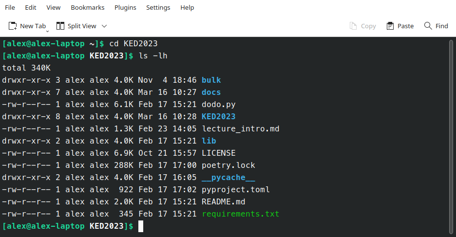

## Recap last lecture

-   installation successful? ⚙️
-   engineering approach 🤓
    -   instructions vs clicks, packages, open-source
-   any questions ❓

::: notes
-   Installation erfolgreich?
    -   unklare Dinge im Guide?
    -   Voraussetzung für weitere Sessions
-   Approach, der auf Modularität und freie Kombinierbarkeit ausgelegt ist (nicht Einfachheit)
    -   commands instead of clicks
:::

## Outline

-   learn principles of the shell 🏛️
-   perform shell commands ▶️
-   get practice by solving exercises 🏗️

::: notes
-   heute Einführung in Shell, nächstes Mal tatsächlich nützliche Dinge
-   Wieso Shell (und nicht Python?)
    -   Grundverständnis Dateisystem
    -   einfacher als Python, Denken/Konzepte sehr ähnlich
-   Shell ist Cockpit heute und nächstel Mal
-   Metaziel
    -   sanfter Einstieg ins Programmieren
    -   Verstehen, was wichtig ist in Computerinteraktion
:::

## What is a computer actually?


### Your computer stores files and runs commands.

::: notes
-   Wir haben eine wichtige Frage ausgeklammert

-   Was ist eigentlich ein Computer? Abstrakt gesehen

-   Maschine, die Daten speichert und Befehle ausführen kann

-   Ohne Daten ist Computer ziemlich nutzlos
:::

## How to get started

### Open a shell

::::: columns
::: {.column width="50%"}
#### macOS

-   open `Terminal`
-   shell type: `zsh`
:::

::: {.column width="50%"}
#### Windows

-   open `Ubuntu 24.04 LTS`
-   shell type: `Bash`
-   ~~open Windows PowerShell~~
:::
:::::

::: notes
-   interaktiv: Studis sollen Bash auch öffnen
    -   rasch durchgehen, damit mehr Übungszeit bleibt
-   Shell Commands plattformübergreifend
-   Shell zeigen: Erscheinungsbild je System unterschiedlich
:::

## The black window: Run commands

### Say hello!

``` bash
echo "hello world"      # print some text
man echo                # get help for any command (e.g., echo)
```

::: notes
-   CLI: Eingabe + Ausgabe gleiches Fenster

-   Tradition von hello world - quotes to preserve whitespace

-   Hilfeseiten sehr umfangreich - googlen oft schneller --\> stackoverflow
:::

## Bourne-again Shell

::::: columns
::: {.column width="40%"}
### Bash

-   offers many built-in tools
-   shell prompt
    -   `USER@HOSTNAME:DIRECTORY$`
-   home directory
    -   `~` refers to `/home/USER`
-   case-sensitive 🔤
-   no feedback 😶
    -   unless there is an issue
:::

::: {.column width="60%"}

:::
:::::

::: notes
-   Computersteuerung komplett über CLI möglich
    -   unnütze Verdoppelung zu GUI?
    -   manche Programme nur über Shell verfügbar
    -   schnelle Inspektion von Daten (wenn nicht PDF etc.)
    -   skalierbar für Tausende Dateien, extremely fast
-   Eigenschaften
    -   kompakter Code -\> komplexe Prozessierung
    -   didaktischer Grund für Aufbau Verständnis
-   Home Directory ist der Startort im Filesystem nach Öffnen
    -   analog Eigene Dateien in Windows
-   no need to memorize syntax
    -   slides, google, stackoverflow
    -   wiederkehrendes auto-erinnern
:::

## Unix philosophy {data-background="var(--green)"}

Build small, extensible programs that *do one thing* <br>and *do it well*. 🤓

## General structure of commands

### Example parts of a command

``` bash
command -a --long_argument OPTIONAL_FILENAME     # non-working example command
```

# Storing files {.white-text data-background-image="../images/drawer_unsplash.jpg"}

::: notes
-   Befehle ein Teil von Computern, Dateien der andere

-   via Orderstruktur in Fenster oder Spotlight, um Datei zu finden

    -   mit schneller Volltextsuche spielt Ablageort kaum mehr eine Rolle für GUI-Approach
    -   Für Engineering-Approach schon: Wie sind Dateien ablegt?

-   Sehr wichtig, aber hat in Vergangenheit Probleme bereitet

    -   Grund: Cloud/App-Abstraktion

    -   Schwierigkeit war mir nicht bewusst
:::

## An analogue equivalent

### Cabinet: Old-fashioned and, likely, you have never used one.

![Illustration of a file cabinet [@Powers2002]](../images/file_cabinet_hierarchy.png)

::: notes
-   Vielleicht hilft Vergleich mit analoger Welt

    -   Aktenschrank mit hierarchicher Struktur

    -   Namen völlig egal, wichtig ist Verschachtelung

-   von grober zu feiner Struktur

    -   zum Beispiel: Archiv mit einer Schublade je Jahr, Fach je Monat, Mappe je Tag, verschiedene Dokumente in Mappe

    -   verschachtelte Ordnerstruktur

-   Dateien auf Desktop als lägen sie ungeordnet auf dem Pult/Desktop

    -   kann vorkommen, ist aber sicher nicht ideal für Weiterverarbeitung
:::

## Where to find files?

### A filesystem has a hierarchical tree structure 🌲 with

::::: columns
::: column
-   folders/directories
-   files with a suffix (e.g. `.jpg`)
:::

::: column
``` bash
.
├── README.md
└── lectures
    ├── images
    │   └── ai.jpg
    ├── html
    │   ├── KED2025_01.html
    │   └── KED2025_02.html
    └── md
        ├── KED2025_01.md
        └── KED2025_02.md
```
:::
:::::

::: notes
-   verschachtelte, hierarchische Struktur = Verzeichnisbaum
-   wie Aktenschrank mit Ordner
    -   Navigation in diesem Baum/Aktenschrank (tiefer/höher)
-   Ordner / Dateien --\> Endungen
    -   keine technische Notwendigkeit
:::

## How to describe the location of a file?

### Use slash `/` to denote a path

-   **absolute paths** start from top-level directory
    -   begins with `/` (uppermost folder)
    -   e.g. `/home/alex/KED2025/slides/KED2025_01.html`
-   **relative paths** when looking from current directory
    -   begins with the name of a folder or file
    -   e.g. `KED2025/slides/KED2025_01.html`

::: notes
-   Wie definiert man einen Ablageort einer Datei/Ordner?
    -   / für Angabe von Pfad (Verzeichnis/Unterverzeichnis)
-   absoluter Pfad beginnt mit Slash, relativer ohne Slash
-   when a file is moved, it has a new path
:::

## What is the path? {data-background="var(--blue)"}

You are in `/home/myuser/documents` that contains<br>the subfolders `pictures` and `texts`.

-   What is the **absolute path** to `texts`?

-   What is the **relative path** to `texts`?

. . .

⚠️ Only relative paths work across systems

::: notes
-   Username ist individuell

-   absolute Pfade funktionieren somit nicht auf anderen Computern
:::

## Important places in your file system

-   shortcut names of directories

    -   `.` current dir
    -   `..` parent dir
    -   `~` home dir (e.g. `/home/alex`)

-   find your files on Windows

    -   `/mnt/c/Users/USERNAME/` (replace with your USERNAME)
    -   shortcut via `documents`

::: notes
-   Windows Leute
    -   / ist Äquivalent zu C: Laufwerk
:::

## Navigating in a file system

``` bash
pwd                 # show absolute path of current directory

ls                  # list content of current directory
ls -lh              # list with more information
ls dirname          # list content of directory dirname

cd ..               # change directory to go folder up
cd dir/subdir       # go to folder dir/subdir (two folders down)
```

. . .

### When you are lost, open the file manager (GUI)

``` bash
open .          # open path in Finder (macOS)
explorer.exe .  # open Explorer in WSL Ubuntu (Windows)
```

::: notes
-   Befehle sind Abkürzungen
    -   cd = change directory
    -   ls = list
-   diskutieren von ls output
    -   Berechtigung/Eigentümer/Grösse/Mod.-datum/Name
    -   d für directory
-   beliebige Verzeichnisse springen
    -   cd zurück ins home
-   Kommentare mit \#
-   Es gibt nur ein Filesystem
    -   über GUI oder CLI einzusehen

<!-- nautilus .     # open path in file manager (Ubuntu) -->
:::

## Open text files

### Show within shell

``` bash
more text.txt           # print content (spacebar to scroll)

head text.txt           # print first 10 lines of file
tail -n 5 text.txt      # print last 5 lines of file
```

## Useful key actions

-   autocompletion: `TAB`
-   history of used commands: ⬆️⬇️
-   scrolling: `SPACEBAR`
-   cancel: `CTRL + C`
-   quit: `q` or `CTRL + D`

::: notes
-   lange Dateinamen, Programme nur halb erinnert
-   q bspw. in Hilfe-Seite man
-   Pause
:::

## Create files and directories

``` bash
touch test.txt          # create a new file

mkdir data              # make a new directory
mkdir -p data/1999      # make a new directory with a subfolder
```

::: notes
-   touch abängig, ob Datei existiert
-   mkdir -p für Subdirs
:::

## Copy and move files

``` bash
cp test.txt other_folder/      # copy file into other folder
mv test.txt new_name.txt       # rename a file
mv test.txt other_folder/      # move file into other folder
```

## Remove files {data-background="var(--red)"}

Watch out, there is no recycle bin. No way back!

``` bash
rm old.txt          # remove a file
rm -r old_data      # remove a folder with all its files recursively
```

## In-class: Exercises I {data-background="var(--blue)"}

1.  Create a new directory called `tmp` in your home directory.
2.  Change into that directory using `cd` and print its absolute path using `pwd`.
3.  Use `touch` to create a new file called `magic.txt` in `tmp`.
4.  Rename the file from `magic.txt` to `easy_as_pie.txt`.
5.  Find the `easy_as_pie.txt` file using your graphical file manager (Windows: Explorer, Mac: Finder)
6.  Check out the helper page of `mv` command.
7.  Look around in the filesystem using `cd` and `ls`. Where are your personal files located?

::: notes
-   10min
:::

## Follow conventions 🙏

-   no spaces/umlauts in names
    -   only: alphanumeric, underscore, hyphen, dot
-   files have a suffix, folders don't
    -   `text_1.txt` vs. `texts`
-   descriptive file names
    -   `SOURCE/YEAR/speech_party_X.txt`

::: notes
-   Reminder!
-   Konventionen helfen Fehler vermindern, Verständnis verbessern
-   auch nicht für usernames
-   Ordnernamen haben keinen Suffix
:::

# How is that useful? 🤔<br>We are getting there!

## Wildcards

### Placeholders to match ...

-   any single character: `?`
-   any sequence of characters: `*`

``` bash
mv data/*.txt new_data/.    # move txt-files from to another subfolder
cp *.txt files/.            # copy all txt-files in a single folder
```

::: notes
-   Wildcards ermöglichen Selektion von Files, ohne alle aufzuführen

    -   Stern entspricht CTRL+A

    -   erlaubt feinere Selektion für Batch Operation

-   bei Unkenntnis oder Zusammenfassung von Dateinamen oder Dateitypen

    -   verschiebe all Testfiles mit spezifischer Endung

    -   viel schneller als Auswahl über grafische Oberfläche

-   Ordner muss existieren

    -   zeige Fehlermeldung
:::

## Searching

### List certain files only

``` bash
# list all files with the suffix .txt (in current directory)
ls *.txt
```

### Find term across files

``` bash
# find all files containing X in provided directory 
grep -r "Europe" /path/to/dir   
```

::: notes
-   grep ist mächtig, häufig brauchen
    -   nur für rohe Textformate (txt, html, csv etc.)
-   kurze Demo für Kursrepository
    -   Dateiname + Zeile mit farblich hervorgehobenem Wort
-   argument -i case-insensitiveness
-   Nächste Sitzung intensiver nutzen
:::

## [Operators]{style="color:#111"} {data-background-image="../images/lego_stack.jpg"}

<!-- https://www.pinterest.ch/pin/518265869592086618/ -->

::: notes
-   Operators machten Probleme
    -   modulares Zusammenbauen von Commands
-   "Leim" zum Übergeben von Zwischenresultaten
    -   Files als Zwischenprodukte umgehen
-   Unix Philosophy
    -   womöglich gibts kein Command, der alles kann, aber wir können Dinge kombinieren
    -   können komplexe Ketten abbilden
:::

## Combining commands

### Use shell operators to ...

-   redirect output into file (overwrite): `>`
-   append to existing file: `>>`
-   stream to next command: `|` (pipe)

``` bash
echo 'line 1' > test.txt    # write into file
more test.txt | tail -n 1   # pass output to next command
```

<br>

[Learn more about operators ⚙️](https://unix.stackexchange.com/questions/159513/what-are-the-shells-control-and-redirection-operators)

::: notes
-   check output first, then overwrite file as a second step
:::

## Merging files

``` bash
cat part_1.txt part_2.txt       # concatenate multiple files
cat *.txt > all_text.txt        # merge all txt into a single one
```

# Questions? {.white-text data-background-image="../images/paint-anna-kolosyuk-unsplash.jpg"}

## In-class: Exercises II {data-background="var(--blue)"}

1.  Create a new file with `touch`.

2.  Write the following content into that file, one line at a time using the append operator:

    ``` markdown
    How about making programming a little more accessible? Like:
    from human_knowledge import solution
    ```

3.  Make sure that the content was written correctly into that file using `more`.

## In-class: Exercises III {data-background="var(--blue)"}

1.  Navigate up and down in in your filesystem using `cd` and list the respective files per directory with `ls`. Where can you find your personal documents? Print the absolute path with `pwd`.\
    Windows users may have a look at `/mnt/c/Users` since they are working on a Ubuntu subsystem.

2.  Read `man ls` and write an `ls` command that lists your documents ordered

    -   by recency (time)
    -   by size

3.  Use the `|` and `>` operators to write the 3 "last modified" files in your documents folder into a file called `last-modified.txt` on your desktop (desktop is also a directory). Write a single command performing multiple operations using operators.

4.  Check out the additional resources on the next slide.

## Additional resources

### Useful intros to Bash

-   [Cheatsheet](https://aflueckiger.github.io/KED2025/materials/cheatsheet_command_line.pdf) for this course
-   [Introduction to the Bash Command Line](https://programminghistorian.org/en/lessons/intro-to-bash) by The Programming Historian
-   [An Introduction to the Linux Terminal](https://www.digitalocean.com/community/tutorials/an-introduction-to-the-linux-terminal) by DigitalOcean
-   [The Unix Shell](https://swcarpentry.github.io/shell-novice/01-intro.html) by Software Carpentry

## References