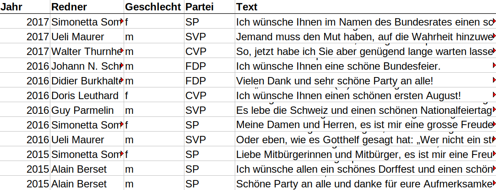

## Recap last lecture

-   understand the filesystem 🌲
    -   `/home/superhero/documents/text_analysis_2025` with `script.py` and `data/dataset.csv`
    -   absolute path to dataset:\
        `/home/superhero/documents/text_analysis_2025/data/dataset.csv`
    -   relative path to dataset from script:\
        `data/dataset.csv`
-   perform shell commands
    -   create/copy/move/remove files 🕹️
    -   pipe output into other command ⏩

::: notes
-   Dateisystem wie Aktenschrank = verschachtelte, hierarchische Ablage
    -   Verzeichnisbaum ist nicht nur Metapher, sondern auch technisch Begriff
    -   Pfade sehr wichtig, auch in Python
-   Einstieg in Shell
    -   Erstellen von Files/Ordner
    -   Piping für komplexere Operationen.
    -   Zwischenresultate an nächsten Command übergeben
:::

## Outline

-   performing corpus linguistic using the shell​ 🔪
    -   counting, finding, comparing​​
-   analyzing programmes of Swiss parties 📊

::: notes
-   letztes Mal wenig inhaltliche Vorteile für Nutzung von CLI, heute erste inhaltlich interessante Analysen
-   Frequenzanalysen
    -   2 Analogien zu Taschenmesser
    -   äusserst effektiv und vielseitig, trotz methodischer Einfachheit
    -   Text in Stücke resp. einzelne Wörter zerschneiden
-   Syntax nicht merken, Wichtiges werdet ihr schlussendlich erinnern
:::

## When politics is changing, <br>language is changing.

)](../images/swiss_party_politics.gif)

::: notes
-   Motivieren der heutigen Sitzung
    -   Positionierung Parteien im politischen Raum über Zeit (1985-2014)
    -   Gleiche Parteien, aber neue Ziele und Positionierung. Also doch nicht so gleich!
    -   Neuer Wein in alten Schläuchen!
-   Wie erkenne ich semantische Veränderungen?
    -   hier: Abstimmungsparolen von Parteien manuell klassifiziert
    -   Alternative: Textanalyse von politischem Diskurs/Parteistatements (induktive Kategorien möglich)
    -   Aufschluss über Ziele/Ideologien
-   Wenn Politik ändert, ändert sich Sprache
    -   oder gerade umgekehrtes zeitliches Verhältnis / Kausalität
    -   in Politik werden Narrative erprobt
    -   was sich kommunikativ bewährt, wird umgesetzt
:::

## How to process a text collection

1.  data in any format ​(​e.g., `​.​pdf​`​)​
2.  each document as individual file ​(​`​.​t​x​t​`​)​
    -   use Shell for quick analysis
3.  a dataset of documents (`.csv`, `.tsv`, `.xml`)
    -   use Python for in-depth analysis

::: r-stack
{.fragment .fade-out}

{.fragment .current-visible height="7cm"}
:::

::: notes
-   Textdaten sind relevant: Wie aber beginnt eine Analyse?
-   Datenextraktion und -zusammenstellung ist oft mehrstufiger Prozess
    -   Artifakt -\> Text -\> Datensatz
-   Start oft via Kommandozeile, dann Auswertung in Python
    -   PDF müssen noch umgewandelt werden
    -   txt-files erste Stufe bei Datensatzerstellung
-   Datensätze
    -   Daten existieren viele, Datensätze eher wenige
    -   Bei tsv/csv-file je Zelle ein Dokument, in gleicher Zeile auch noch Metadaten
    -   sobald strukturierte Daten (Datensatz) -\> Analyse in Python
    -   nach Standardisierung, sind sehr viele Tools vorhanden
-   vorerst arbeiten wir nur mit txt files
    -   ermöglichen sofortige CLI-Analysen
    -   spätere Sitzung für Umwandlung
:::

# Counting Things {.white-text data-background-image="../images/counting_blackboard.jpg"}

## Measuring relevance by frequency

### Bag of words approach

::::: columns
::: {.column width="60%"}
-   counting words regardless of context
-   simple (and simplistic)
-   powerful
-   fast
:::

::: {.column width="40%"}

:::
:::::

::: notes
-   Wieso zählen wir?
    -   Worthäufigkeit deutet auf eine Form von Relevanz hin
-   in Häufigkeitsanalyse sind Worte kontextlos
    -   BoW = Sack mit Wörtern
    -   Approach schmerzt aus sozialwissenschaftlicher Perspektive
    -   Verlust Ambiguitäten/Negationen
    -   Nachteil der radikalen Vereinfachung (einfaches Zählen) = auch grösster Vorteil (wenig Annahmen)
-   Luhmann: ob über etwas gesprochen wird, ist noch wichtiger als das wie
-   ähnlich wie Google Ngram, aber eigene Daten
-   Übersicht über neuere Methoden nach Osterpause
:::

## Get key figures of texts

``` bash
wc *.txt    # count number of lines, words, characters
```

::: notes
-   zuerst Charakterisierung Datenquelle, nicht nur Inhalt
-   Zahlen für einzelne Dokumente und aggregiert auf Sammlung
:::

## Get all word occurrences

### Show phrase in context

``` bash
egrep -ir "data" FOLDER/    # search in all files in given folder

# common egrep arguments:
# -i            search case-insensitive
# -r            search recursively in all subfolders
# --colour      highlight matches
# --context 2   show 2 lines above/below match
```

::: notes
-   PDF und Textfile zeigen von Parteiprogrammen
-   Demo "Politik"
    -   zeigen: pwd, ls, tree, von entsprechenden Folder
    -   grep zeigt ganze Zeile, in dem ein Wort vorkommt
-   options
    -   ignore case
    -   recursive / specific files
:::

## Count word occurrences

### Get term counts per file

``` bash
egrep -ci "big data" *.txt  # search in file of type .txt only

# arguments:
# -c count matches per file
# -i match case-insensitive
```

::: notes
-   Kurze Öko-Analyse: Wer spricht über Ökologie
    -   cd /home/alex/KED2025/ked/materials/data/swiss_party_programmes
    -   egrep -irc "ökologisch" . \| sort
-   Piping zu wc als Alternative
-   Dateinamen als Filter benutzen
    -   Quelle/Jahr
:::

## Word frequencies {auto-animate="true"}

### Steps of the algorithm

1.  split text into one word per line (tokenize)
2.  sort words alphabetically
3.  count how often each word appears

``` bash
# piping steps to get word frequencies
cat text.txt | ... > wordfrq.txt
```

## Frequencies of all words {auto-animate="true"}

### Steps of the algorithm

1.  split text into one word per line (tokenize)
2.  sort words alphabetically
3.  count how often each word appears

``` bash
# piping steps to get word frequencies
cat text.txt | tr " " "\n" | sort | uniq -c | sort -h > wordfrq.txt

# explanation of individual steps
tr " " "\n"     # replace spaces with newline 
sort -h         # sort lines alphanumerically
uniq -c         # count repeated lines
```

::: notes
-   Zweck: Häufigkeiten aller Wörter
-   kein direkter Befehl -\> Kombinieren von Befehlen (modular)
-   Befehle erklären
    -   Zusammenfassen gleicher Zeilen mit uniq
-   Newline Character als Steuerzeichen
    -   normalerweise nicht sichtbar, Zeilenschaltung muss aber auch repräsentiert werden
-   Aggregation extrem flexibel
    -   anderer Text, alle Texte (\*)
-   Frage an Klasse: Was ist häufigstes Wort bei SVP?
    -   Funktionswörter
    -   Schweiz, Bürger etc.: national, männlich
    -   `cat ked/materials/data/swiss_party_programmes/txt/svp_programmes/*txt |  tr " " "\n" | sort | uniq -c | sort -h`
:::

## Convert stats into dataset

-   convert to `.tsv` file
-   useful for further processing
    -   e.g., import in Excel

``` bash
# convert word frequencies into tsv-file
# additional step: replace a sequence of spaces with a tabulator
cat text.txt | tr " " "\n" | sort | uniq -c | sort -h | \
tr -s " " "\t"  > test.tsv  
```

::: notes
-   -s alle Leerschläge durch Tabulator ersetzen
-   relative frequency in Excel berechnen
:::

## Two kinds of word frequencies

-   absolute frequency
    -   `= n_occurrences`
-   relative frequency
    -   `= n_occurrences / n_total_words`
    -   allows to compare corpora of different sizes

::: notes
-   Korpus = Textsammlung
-   absolut nur, wenn grösserer Output (z.B. mehr Dokumente) mitgemessen werden soll
:::

## In-class: Matching and counting I {data-background="#3c70b5"}

1.  Print the following sentence in your command line using `echo`.

    ``` bash
    echo "There are related computational fields: \
    NLP, Computational Linguistics, and computational text analysis."
    ```

2.  How many words are in this sentence? Use the pipe operator `|` to pass the output above to the command `wc`.

3.  Match the word `computational` and colorize its occurences in the sentence using `egrep`.

↪️ Continue on the next slide.

## In-class: Matching and counting II {data-background="#3c70b5"}

4.  Get the frequencies of each word in this sentence using `tr` and other commands.

5.  Save the frequencies into a tsv-file, open it in a spreadsheet programm (e.g., Excel, Numbers) and compute the relative frequency per word.

6.  Are there some words that, although different, should be considered as the same?

::: notes
**Pause**
:::

## Preprocess your data

### refine the results with

-   lowercasing
-   replacing symbols
-   joining lines
-   trimming header + footer
-   splitting into multiple files
-   patterns to remove/extract parts

::: notes
-   Preprocessing für bessere Resultate
    -   Interpunktion
    -   Seitenzahlen entfernen etc.
-   Für Grobüberblick von Textsammlung ist weiteres Preprocessing nicht nötig, heute nicht genauer anschauen
:::

# Text as Pattern

## Searching with patterns

What about **abstract matches** instead of exact matches?

How to find all words starting with the letter `A`?

. . .

``` bash
egrep -r "A\w+" **/*.txt 
```

. . .

How to match any numerical dates?

``` bash
egrep -r "[0-9]{1,2}\.[0-9]{1,2}\.[0-9]{4}"
```

::: notes
-   Frage an Studis
-   wir alle kennen Suchen/Ersetzen
-   musterhafte Beschreibung von Text, statt exakte Beschreibung
    -   flexiblere Suche dank Abstraktion
:::

## When using patterns?

-   finding :mag_right:
-   extracting 🛠️
-   removing/cleaning 🗑️
-   replacing :repeat:

**... specific parts in texts**

::: notes
-   RegEx mit breiter Anwendung
    -   für Preprocessing Textanalysen unverzichtbar
    -   Data Cleaning
-   funktioniert genau gleich in Python, R und allen anderen Programmiersprachen
:::

## An introduction to Regular Expressions (RegEx)

### RegEx builds on two classes of symbols

-   **literal** characters and strings
    -   letters, digits, words, phrases, dates etc.
-   **meta** expressions with special meaning
    -   e.g., `\w` represents all alphanumeric characters

::: notes
-   Regex = Muster = formale Beschreibung von Zeichensequenz
-   Erklären: String = Zeichensequenz
-   zwei Arten von Zeichen
-   Literale: ganz einfach, Zeichen steht für tatsächliches Zeichen
    -   buchstabentreue Repräsentation)
    -   wenn wir nach Wort suchen ist alles literal
-   Meta-Zeichen steht für eine ganze Gruppe/Klasse an Zeichen
    -   hier wird nicht nach der Zeichensequenz gesucht, z.B \w
    -   nützlich für abstrakte Beschreibung von Text
:::

## Combining RegEx with frequency analysis

### Something actually useful! 🤩

``` bash
# count political areas by looking up words ending with "politik"
egrep -rioh "\w*politik" **/*.txt | sort | uniq -c | sort -h

# count ideologies/concepts by looking up words ending with "ismus"
egrep -rioh "\w*ismus" **/*.txt | sort | uniq -c | sort -h

# arguments:
# -o   ouput only match and not entire line
```

::: notes
-   bis jetzt Spielerei, um RegEx zu lernen
-   Hier ein Beispiel:
    -   Was sind die wichtigsten politischen Bereiche?
-   Grundlage für Seminararbeit
    -   systematisches Suchen, quantifizieren und analysieren von Begriffsverwendung
-   zwei Metazeichen
    -   `\w` and \*
:::

## Quantifiers

### Repeat preceding character `X` times

-   `*` zero or any number
-   `?` zero or one
-   `+` one or more
-   `{n}`, `{min,max}` a specified number of times

``` bash
egrep -r "a+"            # match one or more "a"
egrep -r "e{2}"          # match sequence of two "e"
```

⚠️ Do not confuse regex with Bash wildcards!

::: notes
-   erste Klasse von Meta-Symbolen: Quantifikatoren
-   definieren Anzahl von vorangehendem Zeichen
-   in Regex beziehen sich Operatoren auf vorderes Zeichen, in Wildcard nicht
:::

## Character sets

-   `[...]` any of the characters between brackets
    -   any vowel: `[auoei]`
    -   any digit: `[0-9]`
    -   any uppercased letter: `[A-Z]`
    -   any lowercased letter: `[a-z]`

``` bash
egrep -r "[Gg]rüne" # match both `grüne` and `Grüne`

egrep -r "[aeiou]{3}" # match sequences of 3 vowels
```

## Special symbols

-   `.` matches any character (excl. newline)
-   `\` escapes to match literal
    -   `\.` means the literal `.` instead of "any symbol"
-   `\w` matches any alpha-numeric character
    -   same as `[A-Za-z0-9_]`
-   `\s` matches any whitespace (space, newline, tab)
    -   same as `[ \t\n]`

``` bash
# match anything between brackets
egrep -r "\(.*\)"
```

::: notes
-   Klammern sind auch Metasymbole
-   überspringen wenn Zeit knapp
:::

## The power of `.*` 💪 {data-background="#4d7e65"}

Match ***any character*** ***any times***

## In-class: Matching with RegEx {data-background="#3c70b5"}

1.  Go to the website <https://www.swissinfo.ch/ger> and copy a few paragraphs of a random article.

2.  After that, go to the website <https://regex101.com/>and paste the text into the big white field.

3.  Write various regex patterns in the small field to match.

    1.  all uppercased words (\~nouns)
    2.  words with exactly 5 characters
    3.  all words at the beginning of a sentence (\~after a period)
    4.  match everything between quotes

4.  Come up with your own challenge.

::: notes
-   kurz zeigen, um Zeit zu sparen
-   wieso nicht in R or Python?
    -   interaktiv ist besser um Effekte auszuprobieren
:::

# Questions? {.white-text data-background-image="../images/paint-anna-kolosyuk-unsplash.jpg"}

## Additional resources for using Bash

When you look for useful primers on Bash, consider the following resources:

-   [Tutorial Basic Text Analysis by W. Turkel](https://williamjturkel.net/2013/06/15/basic-text-analysis-with-command-line-tools-in-linux/)
-   [Tutorial Pattern Matching + KWIC by W. Turkel](https://williamjturkel.net/2013/06/20/pattern-matching-and-permuted-term-indexing-with-command-line-tools-in-linux/)
-   [Cheatsheet](https://aflueckiger.github.io/KED2025/materials/cheatsheet_command_line.pdf) of this course

## Additional resource for using Regex

-   online regular expression editor [regex101](https://regex101.com/)
    -   to write and check patterns
-   interactive regex tutorial [regexone](https://regexone.com/)
-   introductions to regular expressions
    -   [A Visual Guide to Regular Expression](https://amitness.com/regex/) (highly recommended)
    -   [Regular Expressions](https://dsgithub.com/HumanitiesDataAnalysis/HDA19/blob/master/Handouts/01-regex.pdf) (comprehensive; for digital humanities)

## Optional exercise: Get the programmes of Swiss parties {data-background="#3c70b5"}

1.  Change into your local copy of the GitHub course repository KED2025 and update it with `git pull`. When you haven't cloned the repository yet, follow section 5 of the [installation guide](https://aflueckiger.github.io/KED2025/materials/installation_guide.pdf) .
2.  You find some party programmes (Grüne, SP, SVP) in `ked/materials/data/swiss_party_programmes/txt`. Change into that directory using `cd`.
3.  The programmes are provided in plain text which I have extracted from the publicly available PDFs. Have a look at the content of some of these text files using `more`.

## Optional exercise: Analyzing Swiss party programmes {data-background="#3c70b5"}

1.  Compare the absolute frequencies of single terms or multi-word phrases of your choice (e.g., Ökologie, Sicherheit, Schweiz)...

    -   across parties
    -   historically within a party

    Use the file names as filter to get various aggregation of the word counts.

2.  Pick terms of your interest and look at their contextual use by extracting relevant passages. Does the usage differ across parties or time?