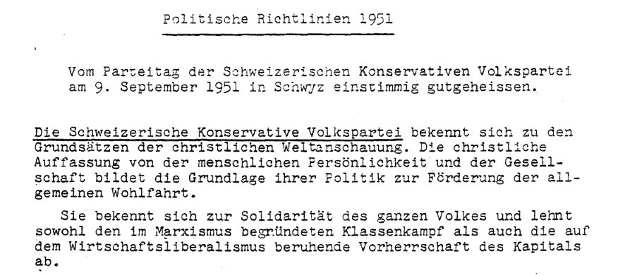
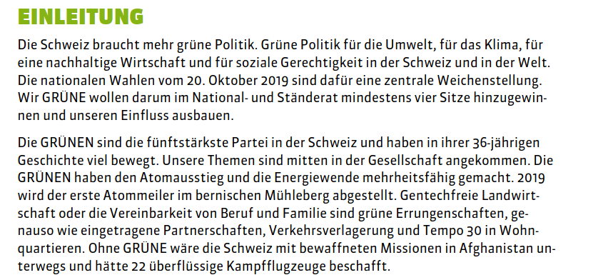

## Recap last lecture

-   introducing Python 🐍

-   learning programming concepts & syntax

    -   data types, loops, indexing, functions...

-   working with VS Code Editor

::: notes
-   praktische Anwendung von "trocken" eingeführten Elementen letztes Mal
-   Kern: Wie werden Daten repräsentiert und verändert in Python
    -   Variablen haben Datentypen
    -   Funktionen: wenn man die gleichen Arbeitschritte durchführen will.
        -   Abstraktion: ich muss mich gar nicht mehr um den genauen Inhalt dieser Funktion kümmern
-   VS Code mit Jupyter Notebooks
:::

## Outline

-   learn about available data sources 🗞️
-   analyze and justify your own data
    -   convert `.pdf` into `.txt` 🔄
    -   count words in Python 🧮

::: notes
-   zweiteilige Sitzung
    -   Wo finde ich geeignete Datenquellen?
    -   Wie kann ich mit Python Text aus eigenen Daten extrahieren?
-   interessannte Datasets für die Sozialwissenschaften
    -   es gibt allerdings nicht viele
    -   zumeist eigene Daten präparieren
-   eigene Textdaten nutzen inkl. Konversion gebräuchlicher Formaten
-   Arbeiten mit Textdaten in Python
:::

# Data sources {data-background-image="../images/text_data_mining.jpg"}

## What data sources are there?

-   broadly social
    -   newspapers + magazines
    -   websites + social media
    -   reports by NGOs/GOs
-   scientific articles
-   economic
    -   business plans/reports
    -   contracts
    -   patents

👉 basically, any textual documents...

::: notes
-   Wir sind eine digitale Gesellschaft, die auf Schriftlichem aufbaut
    -   unheimliche Vielfalt an Dokumenten, alles neue digital
-   Textkollektion ist bereits vorhanden im Gegensatz zu Survey
    -   given data statt created data
    -   Datenaufbereitung nötig
    -   Datenbereinigungen sind nötig
-   hier nur einen Bruchteil vorgestellt, soll als Inspiration dienen
    -   Zeit reicht nicht, um auf alle Quellen einzugehen

[Image Credits](https://www.copyrightuser.org/understand/exceptions/text-data-mining/)
:::

## How does the data look like?

### Any text is data, yet some formats are more suitable

1.  datasets like `.csv` or `.tsv` 🥰
2.  plain text like `.txt` 🙂
3.  text in other formats like `.pdf` 😬

::: notes
-   Am liebsten Datensätze

    -   schön strukturiert in Zeilen und Spalten mit Metainformationen
    -   Unterschied tsv csv
    -   direktes Öffnen in Spreadsheet Programm oder Python

-   txt ohne Metainformation, aber bereit für Analyse

-   PDF braucht Extraktionsschritt

    -   anfangs Seminar angeschaut wir PDF in Texteditoren aussehen

-   manchmal steckt in Metainformation in Dateinamen (z.B Jahr)
:::

## Some great (historical) datasets

### Datasets in `.csv` ready off-the-shelf

-   [1 August speeches by Swiss Federal Councilors](https://www.republik.ch/2019/08/01/anleitung-fuer-die-perfekte-ansprache-zum-1-august)
    -   provided via [course repo](https://github.com/aflueckiger/KED2025/blob/main/ked/materials/data/dataset_speeches_federal_council_2019.csv), converted from [PDFs](https://www.admin.ch/gov/de/start/dokumentation/reden/ansprachen-zum-nationalfeiertag.html)
-   [Human Rights Reports by various NGOs](https://dataverse.harvard.edu/dataset.xhtml?persistentId=doi:10.7910/DVN/IAH8OY)
-   [United Nations General Debate Corpus](https://dataverse.harvard.edu/dataset.xhtml?persistentId=doi:10.7910/DVN/0TJX8Y)
-   [Corpus of Resolutions: UN Security Council](https://zenodo.org/records/11212056)
-   [Inaugural Speeches by US Presidents](https://www.kaggle.com/datasets/adhok93/presidentialaddress)
-   [NewsWire](https://huggingface.co/datasets/dell-research-harvard/newswire)
    -   2.7M US news articles, 1878-1977

<br>

😓 There are still not many.

::: notes
-   sehr wenige standardisierte Datasets
    -   nicht wie bei Survey-Forschung (ESS), numerischer Daten aus Politik und Ökonomie
-   Auswahl, die ich persönlich spannend finde
:::

## Dedicated search engines for datasets

### Use case: Search for existing datasets

-   [Harvard Dataverse](https://dataverse.harvard.edu/)
    -   open scientific data repository
-   [Google Dataset Search](https://datasetsearch.research.google.com)
    -   Google for datasets basically

<br>

👉 search for a topic followed by `corpus`, `text collection` or `text as data`

::: notes
-   fortschrittliche Wissenschaft veröffentlicht nicht nur Papers, sondern auch Daten und Code
-   computergestützte Textanalyse ist aber immer noch Nische
-   Suchmaschinen für Datensätze
    -   nicht nur Text
    -   allerlei Datensätze, primär aus Wissenschaft
-   Thema + Trigger-Wörter die auf Text hinweisen
:::

## Search techniques 🔍 {data-background="var(--green)"}

Make your (Google) web search more efficient by using dedicated [operators](https://support.google.com/websearch/answer/2466433?hl=en). Examples:

-   `"computational social science"`
-   `site:nytimes.com`
-   `nature OR environment`

::: notes
-   spezifischere Suche, weniger, aber genauere Ergebnisse
-   Quotes für Wörter, die zusammen gehören
-   Summe von Wörter haben evtl andere Bedeutung
-   Boolean Search - OR / AND
:::

## [Swissdox](https://swissdox.linguistik.uzh.ch/): A game changer

### Assemble a news dataset and download as `.tsv`

::::: columns
::: {.column width="50%"}
-   over 250 Swiss [newspapers](https://liri.linguistik.uzh.ch/wiki/langtech/swissdox/core/source)
-   historical and updated daily
-   needs registration (free)
:::

::: {.column width="50%"}

:::
:::::

::: notes
-   Plattform von UZH
-   Medienberichte eine der spannendsten Quellen für Analyse sozialer Phänomene
-   Perspektiven:
    -   Längsschnitt (historisch) und Querschnittdaten (Verlage)
    -   Schweizer Illustrierte seit 1911
    -   NZZ seit 1994, Tages-Anzeiger 1995
-   Analyse von einem solchen Datensatz zu Wokeness nächste Woche
    -   kurze Demo
:::

## More publishers

-   [Nexis Uni](http://www.nexisuni.com/)
    -   international newspaper, business + legal reports
    -   licensed by the university
-   [Project Gutenberg](https://www.gutenberg.org/) and [HathiTrust](https://www.hathitrust.org/datasets)
    -   massive collection of books
    -   open, HathiTrust requires agreement
-   [Internet Archive](https://archive.org/)
    -   way-back-machine for web
    -   find "lost" web content

👉 check out other resources licensed by [ZHB](https://www.zhbluzern.ch/recherche/e-medien)

::: notes
-   Nexis ähnlich Swissdox, aber international
-   Projekt Gutenberg
    -   Bücher mit abgelaufenem Copyright (\>70 Jahre)
    -   Download als txt
    -   Wieso Literatur? –\> Repräsentation von Zeitgeist
    -   genderspezifische Sprache, Verweise Natur/Umwelt
    -   relevant für Assignment
-   Internet Archive
    -   way-back-machine with snapshots
    -   check how the internet evolved overtime
:::

## Interesting sources as PDFs

### Any organization of your interest 👍

-   [Party Programmes across Europe](https://visuals.manifesto-project.wzb.eu/mpdb-shiny/cmp_dashboard_dataset/)
    -   covers over 1000 parties from 1920 until today in over 50 countries
-   [Swiss voting booklets](https://www.bk.admin.ch/bk/de/home/dokumentation/abstimmungsbuechlein.html)
    -   from 1977 until today
-   [Swissvotes](https://swissvotes.ch)
    -   collection of resources on Swiss public votings
-   [Curia Vista](https://www.parlament.ch/de/ratsbetrieb/suche-curia-vista)
    -   Swiss parliamentary debates
-   [Nestlé Annual Reports](https://www.nestle.com/csv/performance/downloads)
-   [University of Zurich Annual Reports](https://www.archiv.uzh.ch/de/editionen/jahresberichte.html)

::: notes
-   Quellen meist Politik, Medien oder Firmen/Organisation
-   Jahresberichte UZH seit 1913, durch Studierende entdeckt
    -   grossartige Quelle für Wandel der Institution Universität
:::

## Scraping PDFs from websites

### Use case: [Swiss voting booklets](https://www.bk.admin.ch/bk/de/home/dokumentation/abstimmungsbuechlein.html)

-   `wget` to download any files from the internet

``` bash
# get a single file
wget EXACT_URL

# get all linked pdf from a single webpage
wget --recursive --accept pdf -nH --cut-dirs=5 \
--ignore-case --wait 1 --level 1 --directory-prefix=data \
https://www.bk.admin.ch/bk/de/home/dokumentation/abstimmungsbuechlein.html

# --accept FORMAT_OF_YOUR_INTEREST
# --directory-prefix YOUR_OUTPUT_DIRECTORY
```

::: notes
-   Download Einzeldokument mit wget
    -   in Ubuntu/Terminal nicht Python
-   Wie aber Download automatisieren für viele Dokumente?
    -   Vorteil: schneller systematischer Download & Dokumentation von Quellen
    -   Startpunkt für Crawler, der automatisch alle Links durchsucht
-   kurze Demo in Finder mit Console-Split-Screen
    -   Rechtsklick für Linkadresse
    -   Haupt-URL angeben, wo PDF verlinkt sind
    -   nicht auf alle Argumente eingehen
-   Scraping von Blogs/Social-Media möglich über Python
    -   nicht Teil von Seminar
    -   anbieten für Scraping-Hilfe
:::

# Data is no free lunch 😥

::: notes
-   Daten sind delikate Angelegenheit

    -   Eigentum

    -   Bias

    -   Formate

-   im Folgenden, diese drei Dinge ansprechen
:::

## Data is property 🚫

### ... and has rights too

-   copyrights may further limit access to high quality data
-   check the rights before processing data

{width="70%"}

::: notes
-   Zugang zu Daten nicht immer einfach
    -   Datenbereitstellung oftmals Teil von Geschäftsmodell
        -   dann restriktiv
-   Copyright/Lizenz regelt Nutzung
-   Creative Commons
    -   Beispiel: Wikipedia
    -   nur Attribuierung nötig
-   oftmals ist Verwendung nicht geregelt
    -   nutzt Graubereich für akademischen Rahmen
    -   Faustregel: was für Öffentlichkeit bestimmt ist, kann analysiert werden
:::

## Imperfect data: A tail of bias

-   noise in text

    -   non-content (e.g. table of content), inconsistent spelling

-   archive holes

    -   lost or uncollected data

-   selective corpus curation

    -   supposition that key-word(s) captures topic

-   social bias

    -   view from somewhere, stereotypes

<br>

👉 think about the data and mitigate issues

::: notes
-   non-content elements
    -   Metadaten, repetitive Kopfzeilen etc.
-   fehlende, selektive & verzerrte Daten
-   sozialer Kontext
    -   z.B. Budgetkürzung oder Neuausrichtung --\> Wegfall von Thema
    -   Sicht von weissen Männern auf Thema
:::

## . [A world for humans ...<br>... and a jungle of file formats.]{style="color:#0c0c0c;"} {data-background-image="../images/file_types.jpg"}

<!-- https://www.studio-24-7.com/file-formats-and-their-uses-explained/ -->

::: notes
-   extrem viele File-Typen
-   mühsam, aber es gibt einfache Tools für Umwandlung
:::

## PDF: Digitized or digital?

### Two flavors of `.pdf` documents

::::: columns
::: {.column width="50%"}

:::

::: {.column width="50%"}

:::
:::::

::: notes
-   PDF ist Publikationsstandard
    -   aber zwei Varianten: digitale PDF vs Scan
-   Unterschied: in manchen kann man nicht Suchen
:::

## Optical Character Recognition (OCR)

::::: columns
::: {.column width="50%"}
-   OCR \~ convert images/scans into text
    -   may support handwriting + Fraktur texts
-   conversion steps
    -   convert to b/w image
    -   run OCR model
    -   correct spelling issues
:::

::: {.column width="50%"}

:::
:::::

## Common conversions

### Your text is of a particular type

::::: columns
::: {.column width="50%"}
⬇️

digital native documents <br>`.pdf`, `.docx`, `.html`<br>

⬇️

extract text without formatting
:::

::: {.column width="50%"}
⬇️

scans of (old) documents <br>`.pdf`, `.jpg`, `.png`<br>

⬇️

Optical Character Recognition (OCR)
:::
:::::

<br>

**machine-readable formats:** `.txt` or `.csv` ✅

::: notes
-   nach der Pause Schritte anschauen zur Umwandlung von digitalen PDF
    -   Scans nicht mehr Teil von Programm
    -   Nutzen und Ertrag nicht im Verhältnis, Begriff OCR kennen
:::

## What data are you interested in?

### Think about your mini-project

::::: columns
::: {.column width="50%"}
-   present in last lecture
-   analyze any collection of text documents
    -   compare historically
    -   compare between actors
-   form groups of 2-3 people
-   requirements
    -   apply quantitative measures on multiple documents
    -   interpret and present results in class
    -   share executable script
:::

::: {.column width="50%"}

:::
:::::

::: notes
-   paar Organisatorische Dinge vor der Pause
-   wir werden noch mehr Python Methoden anschauen, wichtig ist aber die Datenquelle
-   Je nach Datenquelle, Aufbereitung unterschiedlich aufwendig
:::

## Assignment #2 ✍️

-   get/submit via OLAT
    -   starting tomorrow
    -   deadline: 19 April 2025, 23:59
-   discuss issues on OLAT forum

::: notes
-   Übung: Wörter zählen aus Buch von Projekt Gutenberg
-   Bash + Python
-   nicht bis zum Schluss warten
-   **Pause** (wichtig, damit genug Zeit bleibt für Coding)
:::

## Let's start [coding](https://github.com/aflueckiger/KED2025/blob/main/ked/materials/code/ked2025_07.ipynb) ✨

## In-class: Exercises I {data-background="var(--blue)"}

1.  Make sure that your local copy of the Github repository KED2025 is up-to-date with `git pull`.
2.  Use `wget` to download *cogito* and its predecessor *uniluAKTUELL* issues (PDF files) from the [UniLu website](https://www.unilu.ch/magazin/service/pdf-und-archiv/#section=c67079). Start with downloading one issue first and then try to automatize the process to download all the listed issued using arguments for the `wget` command.
3.  Convert the *cogito* and *uniluAKTUELL* PDF files into TXT files. You can use the code given for native, digital PDFs (no OCR needed). Try with a single issue first and then write a loop to batch process all of them.
4.  What is the University of Lucerne talking about in its issues? Use the commands of the previous lectures to count the vocabulary.
5.  Do the same as in 4.), yet analyze the vocabulary of *cogito* and *uniluAKTUELL* issues separately. Does the language and topics differ between the two magazines?

# Questions? {.white-text data-background-image="../images/paint-anna-kolosyuk-unsplash.jpg"}