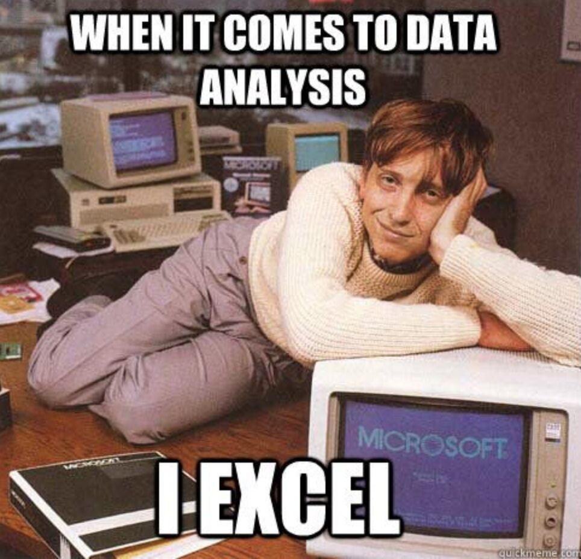

## Recap last lecture

-   an abundance of data sources 📃
    -   often PDF, few datasets
-   creating your own dataset :screwdriver:
    -   convert PDF to `.txt`
-   questions regarding the 2nd assignment❓

::: notes
-   interessante Quellen für Sozialwissenschaften
    -   Unmenge intressanter Daten, wenig Datensätze
    -   Konversion, da Dokument nicht in maschinenlesbarer Form
-   dann gerüstet um mit (fast) allen Textdaten zu arbeiten
-   Übung verbunden mit zweitem Assignment --> Fragen
:::

## Outline

-   Get ready for the mini-project 📝
-   Perform media analysis with Pandas 🐼
    -   based on data from SwissDox

::: notes
-   Zoom öffnen auf Laptop, um Code besser folgen zu können
-   Neben Python, ein weiteres Tier in Zoo
:::

## Mini-project

### Present your project on 23 May 2025

-   analyze any collection of text documents

    -   compare historically

    -   compare between actors

-   form groups of 2-3 people

-   requirements

    -   apply quantitative measures on multiple documents
    -   interpret and present results in class
    -   share executable script

❗ share your project idea [here](https://docs.google.com/spreadsheets/d/1p9ufvzEKvhm7j_Q6EiawdcJDIFpdGHYvTQC_i_dP9aU/edit?gid=0#gid=0) by 1 May 2025

::: notes
-   "Forschungsfrage" überlegen
    -   historisch oder vergleichend
-   script ist gemachte arbeit zur wiederverwendung
-   Code aus diesem Seminar auf eigene Daten anwenden und interpretieren
:::

## Optional seminar paper

-   writing a seminar paper (6 ECTS)
    -   in collaboration with Sophie Mützel
-   get in touch to discuss your idea

## 

::: notes
-   Kennt man Bill Gates noch?

-   Richtige Data Science findet nicht in Excel statt
:::

## Let's start with [real data-science](https://github.com/aflueckiger/KED2025/blob/main/ked/materials/code/ked2025_08.ipynb) ✨

# Questions? {.white-text data-background-image="../images/paint-anna-kolosyuk-unsplash.jpg"}

# Have a nice  Easter break! {.white-text data-background-image="../images/easter-eggs.jpg"}