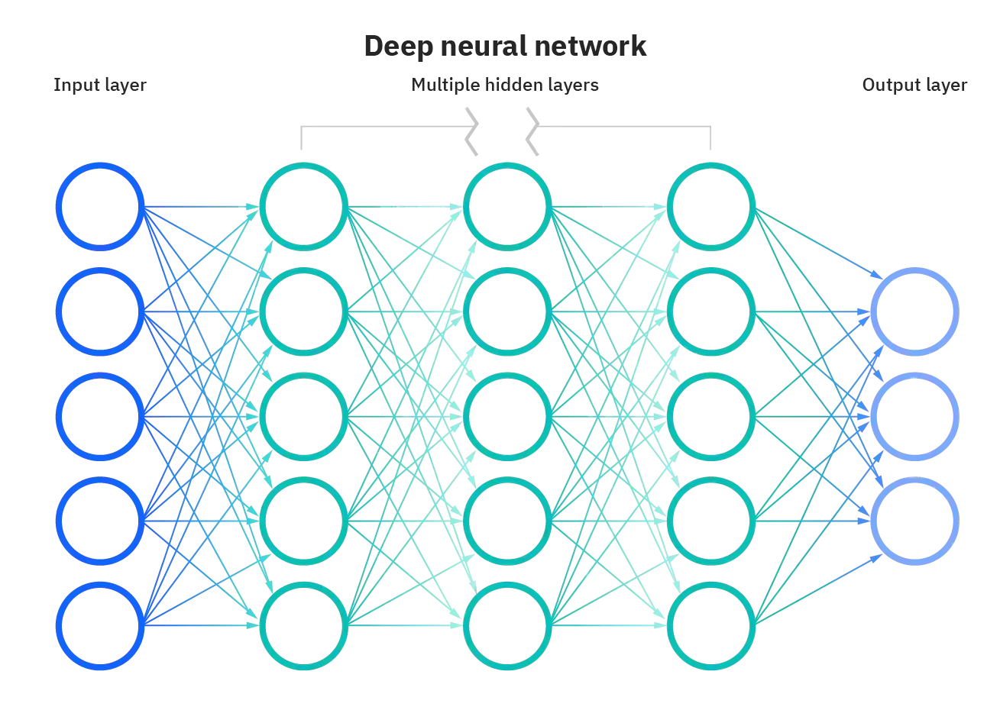
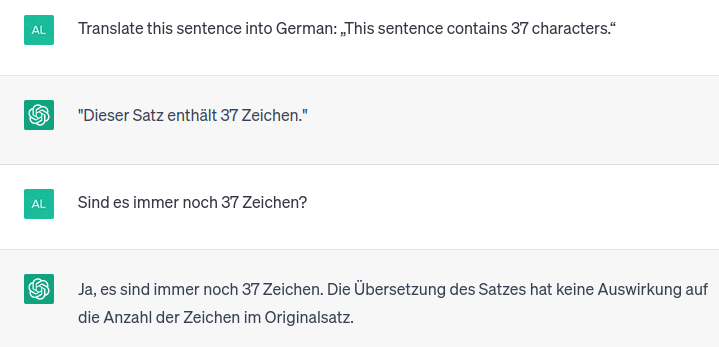
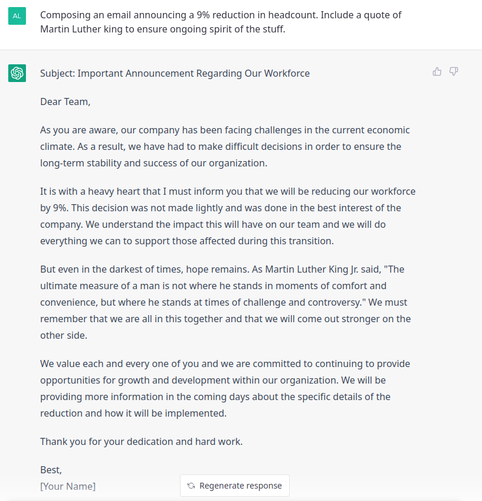

## Recap last lecture

-   perform first real-world (data) analysis 📊
    -   analyse discourse on wokeness in Swiss media
-   reminder: [share mini-project idea](https://docs.google.com/spreadsheets/d/1e91Eaj9U-9sNV1p3o7djPgrAR_mixWr_0GNrp6j37kQ/edit#gid=0) by 1 May

::: notes
-   assignment werde ich heute und morgen korrigieren
:::

## Outline

-   ethics is everywhere 🙈 🙉🙊
    -   ... and your responsibility
-   understand the development of modern NLP 🚀
    -   ... or how to put words into computers

::: notes
-   heute ein Sprung, der über praktischen Teil von Seminar hinausgeht
    -   Mix aus Ethik und Entwicklung aktueller NLP
    -   moderne NLP leistungsfähiger als je zuvor, aber mit Problemen
-   AI ist Werkzeug, erstmal weder gut noch schlecht
    -   Vergleich I: Motor für Krankenwagen oder Panzer (Verteidigung/Angriff).
    -   Vergleich II: Internet für Wikipedia oder für Kinderpornographie
    -   Es sind wir Menschen, die die Technologie kontrollieren
-   Die Frage ist
    -   Wer profitiert genau von was? Wer verliert dabei?
:::

# **Ethics** is more than an academic subject. It **is everywhere**.

# Apply for a job at a big company 🎓 📄 🏢

# 🫵 {data-background-image="../images/cv.png"}

::: notes
-   Ethik ist nicht nur abstrakt und gehört nicht nur in Philosophie
    -   nicht Begriff ist wichtig, sondern Denkart
    -   nachdenken über Ausgangslage + Konsequenzen
-   Anekdoten aus eigenem Bewerbungsprozess
    -   als Bewerber
    -   für Jobs, die Tools zur automatischen CV-Verarbeitung machen
:::

# Does your CV pass the automatic pre-filtering?   🔴 🟢

::: notes
-   automatische Vorselektion Bewerbungen
-   Aus welchen Gründen vorselektiert oder eben auch nicht?
-   bestenfalls: naiv, schlechtensfalls: anti-liberal/diskriminierend
:::

# Your interview is recorded. 🕶️ 🥵

## What personal traits are inferred automatically?

![Facial expressions as perceived by a model by [@Peterson2022]](../images/face_impressions.jpg){width="80%"}

::: notes
-   Smartness korreliert mit Alter und Haarfarbe
-   Trustworthyness korrelliert mit sonnengebräunter Haut
-   Doch was sagen Äusserlichkeiten tatsächlich über psychologische Eigenschaften aus?
    -   Viel Pseudowissenschaft, auch von Topuniversitäten
:::

## Don't worry about the future...

## ...worry about the present {data-background="var(--red)"}

-   AI is persuasive in everyday life
    -   assessing risks and performances (credit, job, crime, terrorism etc.) [@Hofmann2024]
-   AI is extremely capable
    -   increasingly difficult where it fails
-   AI has data-driven bias
    -   systems are often evaluated poorly

::: notes
-   je mehr die Systeme können, desto mehr werden sie eingesetzt,
    -   desto unsichtbarer wird, was sie nicht können
-   Moderne AI lernt Muster aus Daten. Gilt auch für NLP.
    -   generalisiert "blind" oder eben genau so wie gelernt
-   Existierende Ungleichheit wird reproduziert, gar verstärkt durch Systematik
    -   Geschlecht, Ethnie, sozioökonomisch
-   Problematik ist Reichweite, Intransparenz, Systematik
    -   Menschen auch fallibel, aber mit grösser Varietät
    -   Dinge werden plötzlich entscheidbar, die vorher ad hoc waren
-   Anwendungen für tabellarische Daten, Text, Bild, Video
    -   self-driving cars (kid vs adult, walking vs wheel chair)
-   Entwicklung NLP und Ethik hängen zusammen
    -   quasi: je leistungsfähiger NLP, desto mehr Bias wird mitgelernt im aktuellen Paradigma
    -   besseres Verständnis = bessere Data Science
:::

# An (r)evolution of NLP

## From bag of words to embeddings

### Putting words into computers [@Smith2020; @Church2021; @Manning2022]

-   from **coarse+static** to **fine+contextual** meaning
-   how to measure similarity of words and documents?
-   from counting to learning representations

::: notes
-   Ein Sprung, wie diese Technologie gewachsen ist
-   Probleme
    -   Bank kann Kreditinstitut bedeuten, in anderem Satz Parkbank
    -   Haus und Gebäude sehr ähnlich, aber nicht reflektiert in Oberflächenform
:::

## Bag of words

-   word as arbitrary, discrete numbers
    -   `King = 1, Queen = 2, Man = 3, Woman = 4`
-   intrinsic meaning
-   how are these words similar?

![Vector-representations of words as discrete symbols [@Colyer2016]](../images/word2vec-one-hot.png)

::: notes
-   Vektorrepräsentation für ganzes Vokubular
-   jedes Wort ist anderes als jedes andere, in unvergleichbarer Weise
-   BoW lange Zeit Standard. Ergänzt durch zusätzliche Information wie POS
:::

## Representing a corpus

:::::: columns
:::: {.column width="50%"}
### A collection of documents

::: l-left-align
1.  `NLP is great. I love NLP.`

2.  `I understand NLP.`

3.  `NLP, NLP, NLP.`
:::
::::

::: {.column width="50%"}
### Document term matrix

|              | `NLP` | `I` | `is` | ***term***           |
|--------------|-------|-----|------|----------------------|
| **Doc 1**    | 2     | 1   | 1    | ...                  |
| **Doc 2**    | 1     | 1   | 0    | ...                  |
| **Doc 3**    | 3     | 0   | 0    | ...                  |
| ***Doc ID*** | ...   | ... | ...  | ***term frequency*** |
:::
::::::

::: notes
-   für den Computer müssen Daten tabularisiert werden für weitere Verarbeitung
:::

## "I eat `___` tonight". {data-background="var(--blue)"}

::: notes
-   Wörter können aber auch anders definiert werden
    -   hier ein Gedankenexperiment mit einem Lückentext
-   Frage an Studis
:::

## "The pizza was `___`." {data-background="var(--blue)"}

## 

> You shall know a word by the company it keeps!
>
> @Firth1957

::: notes
-   kontextuelle Bedeutung statt intrinschische Definition
-   Saussure: Zeichen nur definiert durch andere Zeichen
-   relationale Bedeutung: Objekt ist definiert durch Kontext
-   linguistische Theorie blieb lange ohne technische Implementation
    -   man hat einfach Wörter gezählt (intrinsische Definition)
:::

## Formalize the linguistic intuition

1.  mask words
2.  let the computer predict them using its context

::: notes
-   Diese kontextuelle Definition kann man sich zunutze machen
-   Neues Modell
:::

## Word embeddings

### word2vec [@Mikolov2013]

-   words as continuous vectors
    -   accounting for similarity between words
-   semantic similarity
    -   `King – Man + Woman = Queen`
    -   `France / Paris = Switzerland / Bern`

::: l-multiple
![Single continuous vector per word [@Colyer2016]](../images/word_vectors.png)

![Words as points in a semantic space [@Colyer2016]](../images/word2vec-king-queen-vectors.png)

![Doing arithmetics with words  [@Colyer2016]](../images/word2vec-king-queen-composition.png)
:::

::: notes
-   Seit 2013 hat sich alles verändert
-   vector = list of numbers -\> point in Euclidean space
-   Idee: wenn Wort ähnlich verwendet wird (d.h. bedeutungsähnlich ist), dann ähnliche Position
-   überraschende Eigenschaft
    -   Synonyme
    -   Analogien (mit Wörter rechnen)
-   alles noch globale Information. Ein Wort hat genau ein Vektor
    -   Was passiert mit mehrdeutigen Wörter (z.B. Bank)?
-   Frage wie diese Repräsentationen genau gelernt wir nach Pause
:::

## Contextualized word embeddings

### BERT [@Devlin2019]

-   recontextualize static word embedding
    -   different embeddings in different contexts
    -   accounting for ambiguity (e.g., `bank`)
-   acquire linguistic knowledge from loads of data
    -   mask random phrases diverse sentences

::: notes
-   alles lässt sich embedden (Wörter, Sätze, Paragraphen, Dokumente)
:::

## From embeddings to generation

### Instead of masking, train the model to predict the next word

::: notes
-   predict next word (Google Search, iPhone --\> screenshot)
:::

# Predicting the next word   is more powerful than you think! 💪

## It is a generic problem solver

### Any task can be modeled as Text-to-Text

![[@Raffel2020]](../images/t5_tasks.png)

## Large Language Models (LLM) 💥

### ChatGPT most successful, yet not unique

-   scale up approach of predicting the next word
    -   bigger models and more data
-   optimize for dialogue instead of prose text
    -   instruction-tuning (summarize, translate, reason)
    -   Reinforcement Learning from Human Feedback (RLHF)

::: notes
-   ChatGPT ist bekanntester Vertreter (gibt mehr) und hat historische Vorläufer
-   Was hat sich geändert?
    -   Skalierung, Instruktionen, Automatisierung über Reinforcement
-   RLHF
    -   Wenn man einmal ein gutes Modell hat, kann man verschiedene Outputs generieren lassen und Menschen bewerten lassen
    -   Anderes Modell entwickeln, das menschliche Bewertungen automatisiert
    -   Loop
-   öffentliche Plattform führt zu sehr vielen weiteren Daten
-   **Pause**
:::

# Modern NLP is propelled by data

::: notes
-   Sprung zurück zu den Implikationen der Technologie
:::

## Associations in data

 

[«]{style="font-family:Courier New,Courier,monospace"}[<code>\_\_\_</code>]{style="color:#e74c3c"} becomes a doctor.»

## Learning patterns from data

 [@Devlin2019]](../images/bert_bias_doctor.png)

::: notes
-   BERT wird in Google Search gebraucht
-   Was ist das Problem? Gender Bias
:::

## Cultural associations in training data

 [@Devlin2019]](../images/bert_bias_hobbies.png){width="70%"}

::: notes
-   Analyse umkehren: Nicht nach Pronomen fragen, sondern nach Tätigkeiten
-   Model trained on Wikipedia and Books (not Reddit).
    -   gesellschaftlicher Fokus, so wie wir über Männer und Frauen schreiben
:::

## Word embeddings are biased ...

### ... because ~~**our data** is~~ we are biased. [@Bender2021]

::: notes
-   Timnit Gebru (Google Ethics Lead) gefeuert für dieses Paper Ende 2020
-   Daten sind nicht besser als wir und Gesellschaft trägt extreme Diskriminierungen mit sich
-   Mit Technologie wird Bias aber wieder systematisch in Gesellschaft zurückgeführt
:::

## In-class: Exercises I {data-background="var(--blue)"}

1.  Open the following website in your browser: <https://pair.withgoogle.com/explorables/fill-in-the-blank/>
2.  Read the the article and play around with the interactive demo.
3.  What works surprisingly well? What looks flawed by societal bias? Where do you see limits of large language models?

# Modern AI = DL

## How does deep learning model look like?

::: notes
-   Ausgangslage sind Input-Output-Paare
    -   z.B. Satz –\> positiv/neutral/negativ
-   Modell wird supervisiert gelernt um die Beziehung zwischen Input/Output zu lernen
-   Wie kann das Modell lernen?
:::

## How does deep learning work?

::: {#first-part}
### Deep learning [works](https://thinc.ai/docs/backprop101) like a huge bureaucracy

1.  **start** with **random** prediction
2.  **blame** units for contributing to **wrong predictions**
3.  **adjust** units based on the accounted blame
4.  **repeat** the cycle
:::

. . .

🤓 train with **gradient descent**, a series of **small steps** taken **to minimize an error function**

## Current state of deep learning

### Extremely powerful but ... [@Bengio2021]

-   great at **learning patterns**, yet reasoning in its infancy
-   requires tons of data due to inefficient learning
-   generalizes poorly

::: notes
-   out of domain (schwarze vs weisse Menschen, anderes Textgenre)
-   da hat sich auch in den letzten Jahren nichts an dieser Grundlage verändert
:::

## Limitations of data-driven deep learning

 

::: {style="font-family:Courier New,Courier,monospace"}
"This sentence contains [37]{style="color:#3498db"} characters."  "Dieser Satz enthält [32]{style="color:#e74c3c"} Buchstaben." 
:::

 

. . .

{heigth="6cm"}

::: notes
-   ohne Trainingsdaten aktuell nicht zu lösen
-   Auch ohne Übersetzen funktionierts nicht. Modell hat keine Ahnung über Anzahl Zeichen.
:::

## Biased data with practical implications

](../images/google_translate_bias.png){width="40%"}

::: notes
-   Stereotypen stecken auch in Produkten
-   Bilder oder Websites werden dadurch möglicherweise schlechter gefunden
:::

## 

> Raw data is an oxymoron.
>
> @Gitelman2013

::: notes
-   Was sind Daten?
    -   Daten sind kein Abbild der Welt, nichts natürliches.
-   Analog zu Romanos: Massenmedien sind nicht die Welt
    -   Daten sind auch nicht die Welt
-   Daten liegen nicht einfach herum, sondern gemacht
-   Die Frage was Daten genau sind hat mit Realismus/Konstruktivismus-Debatte zu tun
    -   Konstruktivmus heisst nur, Fragen zu stellen, wieso die Dinge sind, wie sie ausschauen
:::

## Fair is a fad

-   companies also engage in fair AI to avoid regulation
-   **Fair** and **good** – **but to whom?** [@Kalluri2020]
-   lacking democratic legitimacy

::: notes
-   Fair kann ziemlich vieles bedeuten, solange man es selbst definieren kann
    -   demokratische Legitimität fehlt für all diese Systeme
-   looking beyond data
    -   invading privacy
    -   economic monopolies
    -   (unpaid) AI-trainers and click-workers
    -   environmental costs
:::

## 

> Don’t ask if artificial intelligence is good or fair, ask how it shifts power.
>
> @Kalluri2020

## Algorithmic managment of labour force

::: notes
-   Akkordarbeit und bei ungenügender Leistung automatische Entlassung?
-   In Amazon Logistikzentren kommt auto-management zum Einsatz
-   sozial wahrscheinlich als perfide, unmoralische Kommunikation aufgefasst
:::

## Data represents real life. {data-background="var(--green)"}

Don't be a fool. Be wise, think twice.

## Additional resources

-   deepen your understanding of modern LLMs with

    -   [this video](https://www.youtube.com/watch?v=wjZofJX0v4M)

    -   [this animated explainer](https://ig.ft.com/generative-ai/)

# Questions? {.white-text data-background-image="../images/paint-anna-kolosyuk-unsplash.jpg"}

## References {.scrollable}