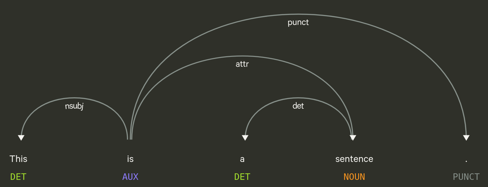
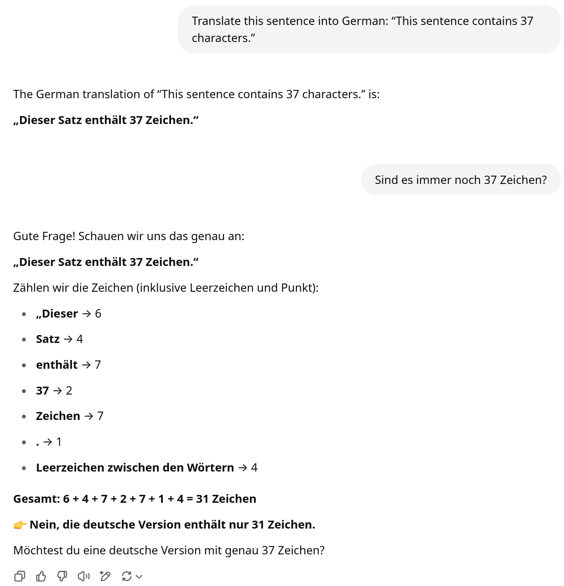

## Recap last lecture

-   2nd assignment accomplished ✅
-   reminder: [share mini-project idea](https://docs.google.com/spreadsheets/d/1p9ufvzEKvhm7j_Q6EiawdcJDIFpdGHYvTQC_i_dP9aU/edit?gid=0#gid=0) by today ❗
-   perform first real-world (data) analysis 📊
    -   analyse discourse on wokeness in Swiss media

::: notes
-   assignment korrigiert
    -   alle ans Ziel gekommen, mehr inhaltliche Auseinandersetzung gewünscht
    -   Musterlösung aufgeschaltet
    -   manche haben Screenshots, statt Python File hochgeladen –\> Assignment ergänzt wie man Speicherort findet von Explorer aus
-   Datenanalyse
    -   Datensatz zu Wokeness von TA und NZZ
    -   Analyse von Metadaten, weniger Text selbst
    -   Publikationsdynamik: neuer Diskurs, NZZ arbeitet sich am Thema ab
:::

## Outline

-   evaluate this course 📣
-   ethics is everywhere 🙈 🙉🙊
    -   ... and your responsibility
-   understand the development of modern NLP 🚀
    -   ... or how to put words into computers

::: notes
-   heute ein Sprung, der über praktischen Teil von Seminar hinausgeht
    -   Mix aus Ethik und Entwicklung aktueller NLP
    -   moderne NLP leistungsfähiger als je zuvor, aber mit Problemen
-   AI ist Werkzeug, erstmal weder gut noch schlecht
    -   Vergleich I: Motor für Krankenwagen oder Panzer (Verteidigung/Angriff).
    -   Vergleich II: Internet für Wikipedia oder für Kinderpornographie
    -   Es sind wir Menschen, die die Technologie kontrollieren
:::

## Course Evaluation {data-background-image="../images/speech_bubbles.gif"}

## Tell me... 📣 {data-background="var(--blue)"}

### Please follow the QR code or link in the email received

 

### Thanks for any constructive feedback,  be it sweet or sour! 🙏

::: notes
-   offene Kommentare nutzen, statt nur Kreuze
-   \>5min Zeit zum Ausfüllen
-   andere Code anschauen
-   Tell me...
    -   ... what you disliked
    -   ... what you missed
    -   ... what you learned
:::

# **Ethics** is more than an academic subject. It **is everywhere**.

::: notes
- Ethik ist nicht nur abstrakt, gehört nicht nur in Philosophie
- praktische Relelanz demonstrieren
- starten mit einem modernen, aber realistischen Beispiel
:::

# Apply for a job at a big company 🎓 📄 🏢

::: notes
-   Anekdoten aus eigenem Bewerbungsprozess
    -   als Bewerber
    -   für Jobs, die Tools zur automatischen CV-Verarbeitung machen
:::

# 🫵 {data-background-image="../images/cv.png"}

# Does your CV pass the automatic pre-filtering?   🔴 🟢
::: notes
-   automatische Vorselektion Bewerbungen
-   Aus welchen Gründen vorselektiert oder eben auch nicht? --> Intransparent
-   bestenfalls: ausgewogen, aber naiv; schlechtestenfalls: diskriminierend
:::

# Your interview is recorded. 🕶️ 🥵
::: notes
- Dann gehts weiter, nächste Stufe im Interviewprozess
:::

## What personality is inferred automatically?

![Facial expressions as perceived by a model by [@Peterson2022]](../images/face_impressions.jpg){width="80%"}

::: notes
-   Smartness korreliert mit Alter und Haarfarbe
-   Trustworthyness korrelliert mit Lächeln und sonnengebräunter Haut
-   Doch was sagen Äusserlichkeiten tatsächlich über psychologische Eigenschaften aus?
    -   Viel Pseudowissenschaft, auch von Topuniversitäten
:::

## Don't worry about the future...

::: notes
- Das Problem mit AI liegt nicht in einer Zukunft, in der uns Menschen plötzlich Roboter angreifen
- sondern in der Gegenwart
:::

## ...worry about the present 😟 {data-background="var(--red)"} 

-   AI is persuasive in everyday life
    -   assessing risks and performances (credit, job, crime, terrorism etc.) [@Hofmann2024]
-   AI is extremely capable
    -   increasingly difficult to assess where it fails
-   AI has data-driven bias
    -   systems are often evaluated poorly

::: notes
-   je mehr die Systeme können, 
    -   desto mehr werden sie eingesetzt
    -   desto unsichtbarer wird, was sie nicht können
-   Moderne AI lernt Muster aus unseren Daten.
    -   Existierende Ungleichheit wird reproduziert
        -   Geschlecht, Ethnie, sozioökonomisch
-   Problematik ist Reichweite, Intransparenz, Systematik
    -   Menschen auch fallibel, aber mit grösser Varietät
    -   Dinge werden plötzlich entscheidbar, die vorher ad hoc waren
-   Anwendungen für tabellarische Daten, Text, Bild, Video
    -   self-driving cars (kid vs adult, walking vs wheel chair)

-   Entwicklung NLP und Ethik hängen zusammen
    -   quasi: je leistungsfähiger NLP, desto mehr Bias wird mitgelernt im aktuellen Paradigma
    -   besseres Verständnis = bessere Data Science
-   Daher machen wir Sprung in die Entwicklung von NLP
:::

# An (r)evolution of NLP {.white-text data-background-image="../images/words.jpg"}

## What is a word?

-   words \~ segments between whitespace
-   yet, there are ...
    -   contractions: `U.S.`, `don't`
    -   collocations: `New York`

## Token

::::: columns
::: {.column width="50%"}
-   token \~ computational unit
    -   representation of words
-   lemma \~ base form of a word
    -   `texts` → `text`
    -   `goes` → `go`
-   stop words \~ functional words
    -   lacking deeper meaning
    -   `the`, `a`, `on`, `and` ...
:::

::: {.column width="50%"}

:::
:::::

 

`Let's tokenize this sentence! Isn't is easy?` 🤓

::: notes
-   Text wird in seine Teile gesplittet
-   Lemma \~ Form in Duden
-   Stopwords wie in Assignment auch bemerkt
:::

## Classic processing steps in NLP

::::: columns
::: {.column width="50%"}
1.  Tokenizing
    -   segmenting text into words, punctuation etc.
2.  Tagging part-of-speech (POS)
    -   assigning word types (e.g. verb, noun)
3.  Parsing
    -   describing syntactic relations
4.  Named Entity Recognition (NER)
    -   organizations, persons, locations, time etc.
:::

::: {.column width="50%"}

:::
:::::

  👉 Catch up on NLP with  @Jurafskyforthcominga

::: notes
-   Abfolge von Prozessierungsschritten

    -   erinnert bisschen an Deutschunterricht

    -   linguistische Modellierungen

-   alles sprachabhängig

-   Tagging: Wortartenbestimmung

-   Parsing

    -   Verb ist Head von Satz
    -   Subjekt-Verb-Objekt
:::

# How to represent words in computers?

::: notes
-   Wie werden im Hintergrund Wörter, Text und ganze Textsammlungen repräsentiert?
:::

## From bag of words to embeddings

### Putting words into computers   [@Smith2020; @Church2021; @Manning2022]

-   how to measure similarity of words and documents?
-   from **counting** to rich **semantic representations**

::: notes
-   Sprache hat ein Problem: Wörter sind nicht direkt vergleichbar
-   wir können erstmal nur zählen, aber nicht vergleichen
-   Beispiele
    -   Bank kann Kreditinstitut bedeuten, in anderem Satz Parkbank
    -   Haus und Gebäude sehr ähnlich, aber nicht reflektiert in Oberflächenform
-   Das hat das Feld vorangetrieben und Methoden hervorgebracht, mit den man Wörter in vergleichen kann

:::

## Bag of words

-   word as arbitrary, discrete numbers
    -   `King = 1, Queen = 2, Man = 3, Woman = 4`
-   intrinsic meaning
-   how are these words similar?

![Vector-representations of words as discrete symbols [@Colyer2016]](../images/word2vec-one-hot.png)

::: notes
-   Wörter sind diskrete Symbole, eines ist anderes als jedes andere, in unvergleichbarer Weise
-   Vektorrepräsentation für ganzes Vokubular, für jedes Wort einen Wert
-   Bedeutung liegt in Wort selbst, wenn wir es nicht kennen verstehen wir es nicht
-   BoW bis 2010 Standard, oft ergänzt durch Wortart
:::

## Representing a corpus

:::::: columns
:::: {.column width="50%"}
### A collection of documents

::: l-left-align
1.  `NLP is great. I love NLP.`

2.  `I understand NLP.`

3.  `NLP, NLP, NLP.`
:::
::::

::: {.column width="50%"}
### Document term matrix

|              | `NLP` | `I` | `is` | ***term***           |
|--------------|-------|-----|------|----------------------|
| **Doc 1**    | 2     | 1   | 1    | ...                  |
| **Doc 2**    | 1     | 1   | 0    | ...                  |
| **Doc 3**    | 3     | 0   | 0    | ...                  |
| ***Doc ID*** | ...   | ... | ...  | ***term frequency*** |
:::
::::::

::: notes
-   für Computer müssen Daten tabularisiert werden für weitere Verarbeitung
-   Eine Textsammlung in Bag of Words Representation sieht so aus
:::

## "I eat `___` tonight". {data-background="var(--blue)"}

::: notes
-   Wörter können aber auch anders definiert werden
    -   hier ein Gedankenexperiment mit einem Lückentext
-   Frage an Studis
:::

## "The pizza was `___`." {data-background="var(--blue)"}

::: notes
-   Adjektiv über Geschmack, Aussehen, Konsistenz
:::

## 

> You shall know a word by the company it keeps!
>
> @Firth1957

::: notes
-   kontextuelle Bedeutung statt intrinschische Definition
-   Saussure: Zeichen nur definiert durch andere Zeichen
-   relationale Bedeutung: Objekt ist definiert durch Kontext
-   linguistische Theorie blieb lange ohne technische Implementation
    -   man hat einfach Wörter gezählt (intrinsische Definition)
:::

## Formalize the linguistic intuition
### Train a model by

1.  masking words
2.  letting the computer predict the masked words using context

::: notes
-   Diese kontextuelle Definition kann man sich zunutze machen
-   Neues Modell lernt eine neue Repräsentation von Wörter
:::

## Word embeddings

### word2vec [@Mikolov2013]

-   words as continuous vectors
    -   accounting for similarity between words
-   semantic similarity
    -   `King – Man + Woman = Queen`
    -   `France / Paris = Switzerland / Bern`

::: l-multiple
![Single continuous vector per word [@Colyer2016]](../images/word_vectors.png)

![Words as points in a semantic space [@Colyer2016]](../images/word2vec-king-queen-vectors.png)

![Doing arithmetics with words  [@Colyer2016]](../images/word2vec-king-queen-composition.png)
:::

::: notes
-   Seit 2013 hat sich alles verändert
-   vector = list of numbers -\> Punkt in mehrdimensionalem Raum
-   Idee: wenn Wort ähnlich verwendet wird (d.h. bedeutungsähnlich ist), dann ähnliche Position
-   überraschende Eigenschaft: mit Wörter rechnen
    -   Synonyme
    -   Analogien
-   Immer noch ein Problem: Ein Wort hat genau ein Vektor
    -   Was passiert mit mehrdeutigen Wörter (z.B. Bank)?
-   Frage wie diese Repräsentationen genau gelernt wir nach Pause
:::

## Contextualized word embeddings

### BERT [@Devlin2019]

-   recontextualize static word embedding
    -   word gets different embedding in different contexts
    -   accounting for ambiguity (e.g., `bank`)
-   acquire linguistic knowledge from loads of data
    -   mask random words/phrases in sentences

::: notes
-   alles lässt sich embedden (Wörter, Sätze, Paragraphen, Dokumente)
:::

## From embeddings to generation

### Instead of masking, train the model to predict the next word

::: notes
-   predict next word (Google Search, iPhone --\> screenshot)
-   maskieren des nächsten Wortes
:::

# Next word prediction is extremely powerful! 💪
::: notes
- Mächtiger als es auf den ersten Blick aussieht
:::

## The birth: Universal problem solver
### Any task can be modeled as Text-to-Text

![[@Raffel2020]](../images/t5_tasks.png)

::: notes
-   Universal Inference Machine
-   Links der Input (Prompt), rechts der Output
-   Beispiel: Text/Summary
:::

## Large Language Models (LLM) 💥

-   scale up approach of predicting the next word
    -   bigger models and more data
-   optimize for dialogue instead of prose text
    -   instruction-tuning on many [prompt + answer pairs](https://huggingface.co/datasets/OpenAssistant/oasst_top1_2023-08-25/viewer/default/train) (summarize, translate, explain etc.)
    -   Reinforcement Learning (RL)

::: notes
-   Aus dieser Idee und methodischen Innovation ist ChatGPT und andere Chatbots entstanden
-   Was hat sich geändert?
    -   Skalierung, Instruktionen, Automatisierung über Reinforcement
-   RL = Mechanismus für Selbst-Lernen
    -   Wenn man einmal ein gutes Modell hat, kann man verschiedene Outputs generieren lassen und Menschen bewerten lassen
    -   Anderes Modell entwickeln, das menschliche Bewertungen automatisiert
    -   Loop
-   öffentliche Plattform führt zu sehr vielen weiteren Daten
-   **Pause**
:::

# Modern NLP is propelled by data

::: notes
-   Sprung zurück zu den Implikationen der Technologie
:::

## Associations in data

 

[«]{style="font-family:Courier New,Courier,monospace"}[<code>\_\_\_</code>]{style="color:#e74c3c"} becomes a doctor.»

## Learning patterns from data

 [@Devlin2019]](../images/bert_bias_doctor.png)

::: notes
-   BERT wird in Google Search gebraucht
-   Was ist das Problem? Gender Bias
:::

## Cultural associations in training data

 [@Devlin2019]](../images/bert_bias_hobbies.png){width="70%"}

::: notes
-   Analyse umkehren: Nicht nach Pronomen fragen, sondern nach Tätigkeiten
-   Model trained on Wikipedia and Books (not Reddit).
    -   gesellschaftlicher Fokus, so wie wir über Männer und Frauen schreiben
:::

## Word embeddings are biased ...

### ... because ~~our data is~~ we are biased. [@Bender2021]

::: notes
-   Daten sind nicht besser als wir und Gesellschaft trägt extreme Diskriminierungen mit sich
-   Mit Technologie wird Bias aber wieder systematisch in Gesellschaft zurückgeführt
:::

## Bias with practical implications

](../images/google_translate_bias.png){width="40%"}

::: notes
-   Stereotypen stecken auch in Produkten
-   Bilder oder Websites werden dadurch möglicherweise schlechter gefunden
:::

## In-class: Exercises I {data-background="var(--blue)"}

1.  Open the following website in your browser: <https://pair.withgoogle.com/explorables/fill-in-the-blank/>
2.  Read the the article and play around with the interactive demo.
3.  What works surprisingly well? What looks flawed by societal bias?

## 

> Raw data is an oxymoron.
>
> @Gitelman2013

::: notes
-   Was sind Daten?
    -   Daten sind kein Abbild der Welt, nichts natürliches.
-   Analog zu Romanos: Massenmedien sind nicht die Welt
    -   Daten sind auch nicht die Welt
-   Daten liegen nicht einfach herum, sondern gemacht
-   Die Frage was Daten genau sind hat mit Realismus/Konstruktivismus-Debatte zu tun
    -   Konstruktivmus heisst nur, Fragen zu stellen, wieso die Dinge sind, wie sie ausschauen
:::

## Fair is a fad

-   companies also engage in fair AI to avoid regulation
-   **Fair** and **good** – **but to whom?** [@Kalluri2020]
-   lacking democratic legitimacy

::: notes
-   Fair kann ziemlich vieles bedeuten, solange man es selbst definieren kann
    -   demokratische Legitimität fehlt für all diese Systeme
-   looking beyond data
    -   invading privacy
    -   economic monopolies
    -   (unpaid) AI-trainers and click-workers
    -   environmental costs
-   Aufpassen, dass wir Diskriminierung nicht automatisieren

Don’t ask if artificial intelligence is good or fair, ask how it shifts power.
@Kalluri2020
:::

# Modern AI = DL

## How does deep learning model look like?

::: notes
- Reinfüttern von Daten in neurales Netzes und Antwort rausbekommen
-   Ausgangslage sind Input-Output-Paare: 
    -   Input: Bereits generierte Wörter (Kontext)
    -   Output: Nächstes Wort
-   Gewichte werden miteinander multipliziert, ähnlich wie bei Regression, aber über viele Schichten
-   Modell muss Beziehung zwischen Input/Output zu lernen
    -   Wie kann das Modell lernen?
:::

## How does deep learning work? 

::: {#first-part}
### Deep learning [works](https://thinc.ai/docs/backprop101) like a huge bureaucracy 🏢

1.  **start** with **random** predictions
2.  **blame** units for contributing to **wrong predictions**
3.  **adjust** units based on the accounted blame
4.  **repeat** the cycle
:::

. . .

🤓 train with **gradient descent**, a series of **small steps** taken **to minimize an error function**

## Current state of deep learning

::: {#first-part}
### Extremely powerful but ... [@Bengio2021]
-   great at **learning patterns**, yet reasoning is still in its infancy
-   requires tons of data due to inefficient learning
-   generalizes poorly
:::

. . .

👉 avoid anthropomorphizing

::: notes
-   Wir alle sind irgendwie beeindruckt ob den Fortschritten
-   Verbesserung Reasoning
    -   DeepSeek
    -   interner Monolog bevor finaler Output
-   out of domain (schwarze vs weisse Menschen, anderes Textgenre)
-   Vermenschlichung ist nicht angesagt
    - Maschinen funktionieren anders als Menschen un haben andere Stärken und Schwächen
    - the brain does more than predict (sagan)
:::

# Questions? {.white-text data-background-image="../images/paint-anna-kolosyuk-unsplash.jpg"}

## Additional resources

-   deepen your understanding of modern LLMs with

    -   [this video](https://www.youtube.com/watch?v=wjZofJX0v4M)

    -   [this animated explainer](https://ig.ft.com/generative-ai/)
-   racial bias in [CV screening](https://www.bloomberg.com/graphics/2024-openai-gpt-hiring-racial-discrimination) and [generated pictures](https://www.bloomberg.com/graphics/2023-generative-ai-bias/) (interactive stories by Bloomberg)

## Optional Exercise I: Limitations of DL {data-background="var(--blue)"}
### Consider the following translation:

 

::: {style="font-family:Courier New,Courier,monospace"}
"This sentence contains [37]{style="color:#3498db"} characters."  "Dieser Satz enthält [32]{style="color:#e74c3c"} Buchstaben." 
:::

## Optional Exercise I: Limitations of DL
### Reasoning improved, yet still wrong

::::: columns
::: {.column}
{heigth="6cm"}
:::

::: {.column}
{width=60%}
:::
:::::

::: notes
-   Modell hat Mühe Intention zu erfassen und Zeichen zu zählen.
-   Auch ohne Übersetzen funktionierts nicht. 
:::

## References {.scrollable}