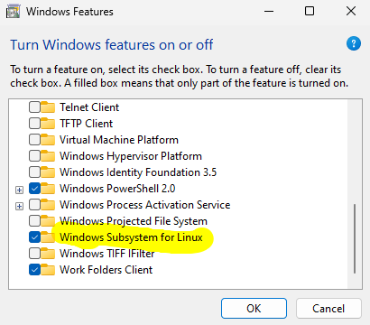
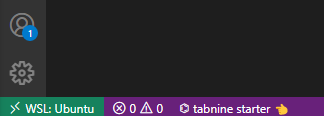
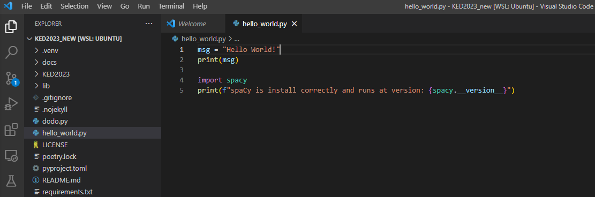

\pagebreak

# Introduction

**IMPORTANT NOTE: Read and follow each step of this guide carefully. When you use a Mac and have Python 3/Anaconda installed already, let me know first before proceeding. Installing naively multiple Python versions may cause problems.**

This guide aims to ease setting up your development environment for Windows 11 and macOS. Depending on your operating system, you have to install additional components to program in Python and perform common data wrangling tasks in the command-line. The instructions cover the installation of the following components:

-   Python 3
-   [VS Code Editor](https://code.visualstudio.com/)
-   various Bash tools

The proposed installation strikes a good balance between relative simplicity and cross-platform usage of the tools. Be aware that the installation and setup of software are sometimes more difficult and poorer documented than its usage. Beyond potential problems during the installation, there are also different ways to set up the development environment.

We write Python code using the VS Code. Although lightweight, it is a fully-fledged integrated development environment (IDE) supporting all major operating systems and many programming languages. Other than competing editors, it doesn't require much configuration and, out-of-the-box, it comes with indispensable features like auto-completion, code formatting, linting (error flagging) and debugging. In VS Code, you can even open and run [Jupyter Notebooks](https://jupyter.org/) to perform interactive data science showing the output next to the code that created it.

Before you proceed with the installation, back up your files[^1] and make sure that your computer fulfills the following two requirements:

[^1]: "Better save than sorry." Backing up files is a must and may save you tears as a computer is a delicate piece of hardware that does not live forever. Moreover, users are also prone to mess up files or software at any point. In these cases, you just want to go back one step and restore your data.

-   runs the most current version of your operating system (Windows, macOS). If not, update your system.
-   has at least 15 GB of free disk space.

**Keep in mind that you will not get *any* feedback in the command-line unless there is an issue.** At first, the lack of feedback after a successful action may be confusing as it runs counter the general experience when working with graphical interfaces. However, the lack of feedback just means the command was executed as expected; thus, there is no need to bother you with further messages.

Let me know if you are struggling with any of the installation steps.

\pagebreak

# Installation Guide for macOS

## Install Command Line Tools

Despite being Unix-based, macOS is lacking some essential command-line tools out-of-the-box. In this section, we install the Command Line Tools first since these tools are also a requirement for the subsequent installation of the package manager Homebrew.

1.  Open a Terminal to get a command-line interface. When you cannot find the application in your system tray, press the `CMD` + `Spacebar` keys to search and type `Terminal` to search for it.

2.  Type the following command and press enter:

    ``` bash
     xcode-select --install
    ```

3.  In the dialogue that pops up, click `Install` and accept the terms and conditions.

4.  As soon as the installer goes away, Command Line Tools should be installed successfully. To ensure that everything works as expected, run the following command:

    ``` bash
    git --version
    ```

    When you see something like this `git version 2.x`, the installation was successful.

Source: [OSXDaily](https://osxdaily.com/2014/02/12/install-command-line-tools-mac-os-x/)

## Install Package Manager Homebrew

Homebrew is a powerful package manager for macOS systems. With Homebrew, you can easily install programms using the Terminal.

1.  To install Homebrew, type the following command into your Terminal window:

    ``` bash
    /bin/bash -c "$(curl -fsSL 
    https://raw.githubusercontent.com/Homebrew/install/HEAD/install.sh)"
    ```

    When there is an issue executing this command (i.e., unprintable characters), copy the identical looking installation command from the [offical website](https://brew.sh/) into your Terminal.

2.  You can make sure that Homebrew was successfully installed by typing:

    ``` bash
    brew doctor
    ```

3.  To ensure that your installation of Homebrew is up to date, run:

    ``` bash
    brew update
    ```

4.  Although it is not needed for now, you can upgrade outdated packages altogether with:

    ``` bash
    brew upgrade
    ```

5.  Once you’ve installed Homebrew, make Homebrew's Python the primary environment by setting the `PATH` variable. In a Terminal, run the following commands to add a new `PATH` variable to the `~/.profile` file:

    ``` bash
    echo 'export PATH="/usr/local/opt/python/libexec/bin:\$PATH"' > ~/.profile
    source ~/.profile
    ```

```{=html}
<!---

https://stackoverflow.com/questions/5157678/how-do-i-use-brew-installed-python-as-the-default-python

https://github.com/Homebrew/discussions/discussions/476

https://ahmadawais.com/python-not-found-on-macos-install-python-with-brew-fix-path/

--->
```

\
Source: [Homebrew](https://docs.brew.sh/FAQ)

## Install Python 3 with Homebrew

Homebrew makes it easy to install Python 3.

1.  Run the following command in a Terminal:

    ``` bash
    brew install python@3.12
    ```

2.  When Python 3 has been installed correctly on your system, you should see version 3.x after issuing the following command:

    ``` bash
    python3 --version
    ```

Source: [The Hitchhiker’s Guide to Python](https://docs.python-guide.org/starting/install3/osx/)

### Enable auto-completion

Turn on auto-completion for names using the tabulator key:

``` bash
echo 'autoload -Uz compinit && compinit' >> ~/.zshrc && . ~/.zshrc
```

### More tools

1.  Install the tool wget that allows you to retrieve content from web servers via the command-line with:

    ``` bash
    brew install wget
    ```

2.  Install poppler that allows you to render PDFs via the command-line:

    ``` bash
    brew install poppler
    ```

## Install VS Code

Unless you have another favourite coding editor, install and customize VS Code editor.

1.  Download and install VS Code from the official website: <https://code.visualstudio.com/Download>. You may want to add a shortcut icon to the desktop.

2.  Open VS Code.

3.  Set up `Copilot` for free as shown in (see @fig-copilot), which is an AI assistant that helps you programming. You have to create a GitHub account to use it. All the other configuration, you may skip by clicking *Next Section*.

4.  To make programming in Python easier, you should install VS Code Python extension. Launch again the *VS Code Quick Open* by pressing `CTRL`+`P`, paste the command, and press enter:

    ```         
    ext install ms-python.python
    ```

\pagebreak

# Installation Guide for Windows

## Install Ubuntu in a Windows Subsystem

To use the powerful Bash tools on your Windows computer, we install a Ubuntu Linux system within the Windows environment using WSL1.

1.  Open `PowerShell` as administrator by right-clicking on the application icon in the start menu and run the following command in the shell:

    ``` powershell
    wsl --set-default-version 1
    wsl --install -d Ubuntu
    ```

    If something doesn't work, search for `Turn Windows feature on or off` in the menu, and ensure that `Windows Subsystem for Linux` is enabled (see @fig-conf-wsl). You have to restart the computer after enabling.

2.  Reboot your computer to complete the installation of WSL and Ubuntu.

3.  The installation should be completed automatically after the reboot. If not, you can launch Ubuntu from your Windows start menu. When you have any problems, let me know and I will gladly assist. It may require [additional configuration](https://askubuntu.com/questions/1264102/wsl-2-wont-run-ubuntu-error-0x80370102) of your BIOS.

4.  Once the installation is complete, you will be prompted to create a new user account and set a password. **IMPORTANT**: Remember these credentials as they are used to switch to the administrator mode on your Linux system. You may choose the same account name and password as on your host Windows system.

5.  After the login, update your freshly installed Ubuntu system with the following commands and confirm with `Y`:

    ``` bash
    sudo apt update && sudo apt upgrade
    ```

6.  Create a symbolic link in the Bash to easily access your files on Windows. For example, you may want to link the folder `Documents` on Windows to the symbolic folder `documents` on Ubuntu. For people using OneDrive, they can also set a symbolic link to this directory. For this, replace the `USERNAME` with the actual username on your Windows computer and run the following commands:

    ``` bash
    cd ~
    ln -s "/mnt/c/Users/USERNAME/Documents" documents
    ln -s "/mnt/c/Users/USERNAME/OneDrive/" onedrive
    ```

    Your `Documents` on Windows can be accessed like this:

    ``` bash
    ls documents
    ```

Source: [Microsoft](https://docs.microsoft.com/en-us/windows/wsl/install)

{#fig-conf-wsl width="40%"}

```{=html}
<!--- Credentials on the Ubuntu system in the virtual machine: vboxuser: student password: changeme 

5.  Annoyingly, the copy/paste behaviour is different in command lines on Windows. Open the menu with a `right-click` on the Windows title bar → `Properties` → `Options` ) and enable `Use Ctrl+Shift+C and Ctrl+Shift+V as Copy/Paste`. For the following steps, you can simply copy the commands using the keyboard shortcut. Please note, that using `Ctrl+C` is not possible as it is used to cancel a running program.
--->
```

\pagebreak

## Install additional command-line tools

1.  Open Ubuntu from your start menu in Windows.

2.  Install essential tools via the command-line:

    ``` bash
    sudo apt-get install build-essential
    ```

3.  Install the Python package manager PIP:

    ``` bash
    sudo apt install python3-pip
    ```

4.  Install poppler that allows you to render PDFs via the command-line:

    ``` bash
    sudo apt install poppler-utils
    ```

5.  Close and reopen Ubuntu.

## Install the editor VS Code

Unless you have another favorite coding editor, install and customize VS Code editor.

1.  Download and install VS Code from the official website: <https://code.visualstudio.com/Download>. You may want to add a shortcut icon to the desktop.

2.  Open VS Code.

3.  Set up `Copilot` for free as shown in (see @fig-copilot), which is an AI assistant that helps you programming. You have to create a GitHub account to use it. All the other configuration, you may skip by clicking *Next Section*.

4.  We want to execute all the Python code within the Ubuntu subsystem. For this, we need to install a particular extension. Launch the *VS Code Quick Open* by pressing `CTRL`+`P`, paste the following command, and press enter:

    ```
    ext install ms-vscode-remote.vscode-remote-extensionpack
    ```

5.  In the left lower corner, you should now see a green label with `WSL: Ubuntu` (see @fig-wsl). If not, press `F1`, select *WSL: New WSL Window* to connect the subsystem.

6.  To make programming in Python easier, you should install VS Code Python extension. Launch again the *VS Code Quick Open* by pressing `CTRL`+`P`, paste the command, and press enter:

    ```         
    ext install ms-python.python
    ```


Source: [Microsoft](https://code.visualstudio.com/docs/remote/wsl)

{#fig-wsl width="40%"}

{#fig-copilot width="40%"}

## Show file extensions

You may not see the file extensions on Windows by default. For example, a document named `test.docx` is shown as `test` in Explorer. If this is the case, enable the file extensions.

1.  Open File Explorer (`Windows key` + `E`).
2.  Click on "View", select "Show", and choose the "File name extensions"

# Installation Guide for Linux

You presumably have installed some of the required tools already or you have the necessary knowledge to do so. Otherwise, ask me anytime or just google for a manual. Anyways, you are lucky as it is simpler than on the other platforms. Linux rules them all when it comes to development.

\pagebreak

# Getting started with Python (all Systems)

## Install Python packages

We need to install some additional packages that are not included in the Python standard library.

Using the dependency management `poetry`, we can install all the dependencies needed in a project at once and fully reproducible on any machine. All dependencies are specified in a file called `pyproject.toml` that is provided in the [repository of this seminar](https://github.com/aflueckiger/KED2025/blob/ked/pyproject.toml)), available on GitHub. We will learn more about GitHub and the installed packages later in the course. For now, you can think of a GitHub repository as a publicly available project folder that is versioned.

1.  Open a command-line (Mac: Terminal; Windows: Ubuntu) and download the GitHub repository of this course.

    ``` bash
    # Windows user only:
    # change into the `Documents` folder for better accessibility
    # replace USERNAME with your actual username
    cd /mnt/c/Users/USERNAME/Documents

    # everyone
    git clone https://github.com/aflueckiger/KED2025.git
    cd KED2025
    ```

2.  Install the dependency management for Python:

    ``` bash
    curl -sSL https://install.python-poetry.org | python3 -

    echo 'export PATH="$HOME/.local/bin:$PATH"' >> ~/.profile
    source ~/.profile
    ```

3.  Configure poetry to use the project directory for its virtual environment:

    ``` bash
    poetry config virtualenvs.in-project true
    ```

4.  Now, you can install the necessary packages with a single command:

    ``` bash
    poetry install
    ```

## First Steps in Python

As a kind of initiation ritual of coding, say hello to the programming world in Python and check if everything is installed successfully.

1.  Open the VS Code editor.

2.  Windows only: Ensure that you connected to `WSL: Ubuntu` (green or blue patch in the lower-left corner, see @fig-wsl)

3.  Open the folder `KED2025` via the menu.

4.  Create a new file called `hello_world.py`.

5.  Copy the following code in that file (see @fig-script):

    ``` python
    msg = "Hello World!"
    print(msg)

    import spacy
    print(f"spaCy is installed correctly and runs at version: {spacy.__version__}")
    ```

6.  Execute the code by right-clicking in the window and choosing `Run Python File in Terminal`.

7.  When you see the version number of spaCy, everything works fine. If you get a `ModuleNotFoundError`, let me know.

Congrats, you wrote your first little program in Python. It may not be as impressive as you would have imagined, but you can go along and learn by practicing more. The list of tutorials below provides a great starting point to learn the basics of Python by solving little exercises interactively:

-   [Python Principles](https://pythonprinciples.com)
-   [LearnPython](https://www.learnpython.org/en/Welcome)

{#fig-script width="80%"}