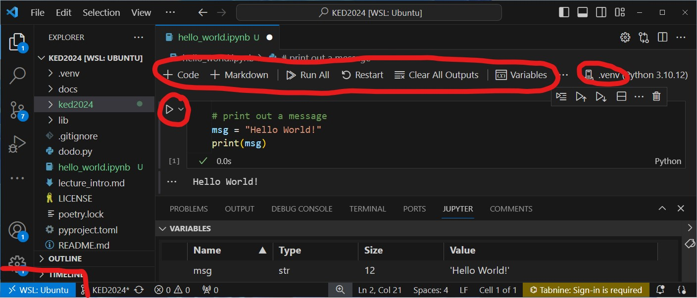

## Recap last lecture

-   perform a frequency analysis using the Shell 🧮
    -   specific words or entire vocabulary
-   describe text as pattern using RegEx 🧩
    -   literal: `media a b c`
    -   meta: `. \w \s [0-9] *`
    -   power of `.*`

::: notes
-   Häufigkeitsanalysen
    -   Bag of words –\> einfach, aber mächtig
    -   Auszählung von Vokabular erlaubt Einblick mit minimalsten Vorannahmen
-   Regex für Extraktion + Säubern
    -   man muss nur ungefähr wissen wonach suchen
    -   generalisierte Form = Muster
    -   Literale = Zeichen steht für tatsächliches Zeichen (buchstabentreu)
    -   Meta-Zeichen = Zeichen mit spezieller Bedeutung
-   Fragen zu RegEx?
:::

## Outline

-   enter the shiny world of Python 😎

-   get familiar with Visual Studio Code

::: notes
-   Einstieg in Python erst jetzt
    -   Einstieg mit Bash einfacher
    -   Konzepte von Pfaden, regulären Ausdrücken etc. funktionieren genau gleich
-   Schritt weg von Textanalysen
    -   erarbeiten zuerst Grundlagen und lernen Editor kennen
-   Grundverständis notwendig für NLP-Analysen
:::

# [Python]{style="color:white;"} {data-background-image="../images/green_python.jpeg"}

<!-- https://pixabay.com/de/photos/gr%C3%BCne-baumpython-python-baumpython-543243/ -->

::: notes
Python != Schlange
:::

## Python is ...

::: columns
::: {.column width="60%"}
### a programming language that is ...

-   general-purpose
    -   not specific to any task
-   interpreted
    -   no compiling
-   very popular in data science
:::

::: {.column width="40%"}

:::
:::

::: notes
-   viele Programmiersprachen, wie natürliche Sprachen auch
    -   100te verschiedene Programmiersprachen
    -   Bash haben wir schon kennengelernt
    -   alle mit ungefähr gleichem Ziel, aber unterschiedlichen Mitteln dahin zu kommen
-   Python vs. R
    -   Python breiter einsetzbar
    -   viele Tools für DataScience für beide Sprachen
:::

## How to learn Programming?

### Some inconvenient truths 😰

-   programming cannot be learnt in a course alone
    -   I try to make the **start** as easy as possible!
-   frustration is part of learning
    -   **fight** your way through!
-   the Python ecosystem is huge
    -   **grow** your skills by step-by-step

::: notes
-   Es wäre gelogen zu sagen, Programmieren sei einfach
-   Welt des Programmierens ist riesig
    -   es gibt mehr Möglichkeiten/Einschränkungen als ich zeigen kann
-   Praxis wichtiger als Theorie
-   vieles wird nicht unmittelbar klar
    -   lernen aus Fehlern, wenn sie passieren
-   Programmbeispiele sind möglichst kurz / einfach geschrieben
:::

## Programming can be absolutely captivating! ✌️ {data-background="var(--green)"}

::: notes
-   Positives
    -   unmittelbares feedback
    -   tolles Gefühl, wenns klappt
    -   selbständiges Lernen ist gut möglich
-   Gamification ohne Animationen!
:::

# [Wheting your Appetite]{style="color:#1c1b1b"} {data-background-image="../images/scattertext_example.png"}

# Programming Concepts & <br>Python Syntax 🧠

## Variables

### Variables are kind of storage boxes 🎁

``` python
# define variables
x = "at your service"
y = 2
z = ", most of the time."

# combine variables
int_combo = y * y       # for numbers any mathematical operation
str_combo = x + z       # for text only concatenation with +

# show content of variable
print(str_combo)
```

::: notes
-   Variablen sind das wichtigste Konzept!
-   Variablen sind wie Aufbewahrungsboxen, ein Tupperware
    -   etwas (Objekte) reinstecken
    -   bei Gebrauch hervorholen
-   technisch Wert zuweisen und auf Wert zugreifen
-   Summieren von Buchstaben –\> Aneinanderhängen
-   Namenskonvention von Variablen: Kleinschreibung, English, underscore statt space
:::

## Data types

### The type defines the object"s properties

<br>

| Name           | What for?                    | Type       | Examples                             |
|------------------|-------------------|------------------|------------------|
| String         | Text                         | str        | `"Hi!"`                              |
| Integer, Float | Numbers                      | int, float | `20`, `4.5`                          |
| Boolean        | Truth values                 | bool       | `True`, `False`                      |
| ⋮              | ⋮                            | ⋮          | ⋮                                    |
| List           | List of items (mutable)      | list       | `["Good", "afternoon", "everybody"]` |
| Tuple          | List of items (immutable)    | tuple      | `(1, 2)`                             |
| Dictionary     | Relations of items (mutable) | dict       | `{"a":1, "b": 2, "c": 3}`            |

::: notes
-   es gibt verschiedene Objekte
    -   Datentypen sind unabhängig von Programmiersprache
    -   je nach Typ andere Eigenschaften
-   Typ ist immer implizit (dynamisch), nicht angeben bei Zuweisung
-   Liste ist eine grosse Box, die kleine Boxen aufnehmen kann
-   Tuple ist das gleiche nur kann man nicht mehr ändern an dieser Box, nur reinschauen
:::

## Converting data types

### Combine variables of the same type only

``` python
# check the type
type(YOUR_VARIABLE)

# convert types (similar for other types)
int("100")  # convert to integer
str(100)    # convert to string

# easiest way to use a number in a text
x = 3
mixed = f"x has the value: {x}"
print(mixed)
```

::: notes
-   Analogie: nur gleiche Schachteln können kombiniert werden
:::

## Confusing equal-sign

### `=` vs. `==` contradicts the intuition

``` python
# assign a value to a variable
x = 1
word = "Test"

# compare two values if they are identical
1 == 2              # False
word == "Test"      # True
```

::: notes
-   = mit ungewohnter Funktion
-   = Zuweisungsoperator
    -   in Schule gelernt: Entsprechung linker + rechter Seite
    -   R nutzt \<-
-   == Vergleichsoperator
:::

## Comments

-   lines ignored by Python
-   write comments, it helps you... 📝
    -   to learn initially
    -   to understand later

``` python
# single line comment

"""
comment across 
multiple 
lines
"""
```

## Visual Studio Code

### The (best) editor to program in Python

::: columns
::: {.column width="50%"}
-   VS Code features
    -   interactive programming
    -   integrated development environment (IDE)
    -   similar to RStudio
-   use `tab` for autocompletion
:::

::: {.column width="30%"}
](../images/vs_code.png)
:::
:::

## Jupyter Notebooks `.ipynb` {data-background="#3c70b5"}

-   combine text and code in a single document
    -   similar to [R Markdown](https://rmarkdown.rstudio.com/)
-   see also explainer for usage in [VS Code](https://code.visualstudio.com/docs/datascience/jupyter-notebooks)

## Get started in VS Code

1.  *Windows user only*: connect to WSL Ubuntu left-lower corner
2.  open KED2024 via menu `File > Open Folder`
3.  load Python environment `.venv`
4.  create notebook via menu `File > New File > Jupyter Notebook`
5.  run code with ▶️ left to the cell or with CTRL+Enter
    -   output shows below cell
6.  check out the control bar for global actions at the top


::: notes
-   demonstration of hello world example
    -   run script interactively
    -   variable explorer
    -   problems in case of wrong syntax
        -   rename `msg` to `message`
        -   remove `=`
    -   tab for completion
    -   **Pause**
:::

## How it should look like



## In-class: Get started with Python {data-background="#3c70b5"}

1.  Make sure that your local copy of the Github repository KED2024 is up-to-date with `git pull` in your command-line.
2.  Open the Visual Studio Editor.
3.  Windows User only: Make sure that you are connected to `WSL: Ubuntu` (blue badge in lower-left corner). If not, click on the badge and select `New WSL Window`.

## In-class: Run your first Python program {data-background="#3c70b5"}

1.  Follow the steps described on the slide `Get started in VS Code`.

2.  Create a new file `Jupyter Notebook` with the following content, save it as `hello_world.ipynb` in the `KED2024` folder. Then, run the code.

    ``` python
    # print out a message
    msg = "Hello World!"
    print(msg)
    ```

3.  Does the output looks like the screenshot on the previous slide? If the execution doesn't work as expected, ask me or your neighbour. There might be a technical issue.

4.  When you are done already, you can experiment with the data types that we have discussed.

## Iterations

### for-loop

do something with each element of a collection

``` python
sentence = ["This", "is", "a", "sentence"]

# iterate over each element
for token in sentence:
    
    # do something with the element
    print(token)    
```

::: notes
-   Anwendungsfall
    -   für viele Objekte das gleiche machen
-   sentence + token sind Variablen
    -   token ist temporäre Variable (Inhalt ändert sich während Loop)
-   in Loop können Operationen durchgeführt werden
:::

## Conditionals

### if-else statement

condition an action on variable content

``` python
sentence = ["This", "is", "a", "sentence"]

if len(sentence) < 3:
    print("This sentence is shorter than 3 tokens")
    
elif len(sentence) == 3:
    print("This sentence has exactly 3 tokens")
    
else:
    print("This sentence is longer than 3 tokens")
```

::: notes
-   Anwendungsfall
    -   Aktion abhängig machen von Variableninhalt
-   Frage: Was wird ausgegeben?
-   Noch etwas weiteres, neues kommt dazu: len()
    -   Funktionen für Länge und Print
:::

## Indentation matters!

::: columns
::: {.column width="50%"}
-   intend code within code blocks
    -   loops, if-statements etc.
-   press `tab` to intend (`shift + tab` to unintend)
:::

::: {.column width="50%"}
✅

``` python
if 5 > 2:
    print("5 is greater than 2")
```

❌

``` python
if 5 > 2:
print("5 is greater than 2")
```
:::
:::

::: notes
-   tab wird umgewandelt in 4 spaces
:::

## Methods: Create new objects

### Build your world! 🌍

``` python
sentence = "This is a sentence"

# split at whitespace and save result in new variable
tokens = sentence.split(" ")    

# check the content and type variables
print(sentence, type(sentence), tokens, type(tokens))           
```

::: notes
-   Konzept von Objekt hat mit Objektorientierung zu tun
    -   für uns ist jede Variable einfach ein Objekt mit bestimmten Typ
-   jedes Objekt/Variable stellt bestimmte Methoden zur Verfügung
:::

## Methods: Change objects

### Depending on the object, you can do different things 🛠️

``` python
# add something to a list
tokens.append(".")

# concatenate elements to string
tokens = " ".join(tokens)
print(tokens, type(tokens))
```

## Functions and arguments

### DRY: Don't Repeat Yourself

-   functions have a name and optional arguments
    -   `function_name(arg1, ..., argn)`
    -   predefined functions: `print() len() sorted() ...`

``` python
def get_word_properties(word): # define function
    """
    Print properties for a word and return its length.
    """
    length = len(word)
    sorted_letters = sorted(word, reverse=True)
    print(f"{word} has {length} letters: {sorted_letters}".)

    return length # optional return value

word_length = get_word_properties("computer") # call function
```

::: notes
-   DRY ist ein Grunprinzip beim Programmieren
-   Anwendungsfall
    -   Code strukturieren, Redundanzen vermeiden
-   zwei Teile: definieren + aufrufen
-   Funktion mit vordefinierten Argumenten
    -   mehr Argumente geht nicht
-   Es gibt auch vordefinierte Funktionen
-   berechneter Wert kann zurückgegeben werden
:::

## Indexing

### Computers start counting from zero! :dizzy_face:

``` python
sentence = ["This", "is", "a", "sentence"]

# element at position X
first_tok = sentence[0]     # "This"

# elements of subsequence [start:end]
sub_seq = sentence[0:3]     # ["This", "is", "a"]

# elements of subsequence backwards
sub_seq_back = sentence[-2:]        # ["a", "sentence"]
```

::: notes
-   Anwendungsfall
    -   nur ein Teil der Objekte auswählen
:::

## Errors

### A myriad of things can go wrong :facepalm:

::: columns
::: {.column width="50%"}
1.  check the underlined (i.e., erroneous) code
2.  read the error message
3.  find the source of the error
    -   line number given in code
4.  paste error into Google
5.  restart interactive environment
    -   you may have left-over variables defined
:::

::: {.column width="50%"}
<!-- https://gifer.com/en/78BJ -->

](../images/google_rubiks.gif)
:::
:::

::: notes
-   produce NameError, TypeError
:::

## Modules/Packages

### No programming from scratch 🎉

-   packages provide more objects and functions
-   packages need to be installed additionally

``` python
# import third-party package
import pandas
import spacy
import plotnine
```

::: notes
-   Standing on the shoulders of giants
-   alles auf GitHub
:::

## In-class: Exercises I {data-background="#3c70b5"}

1.  Open the Jupyter Notebook with the basics of Python in your Visual Studio Editor:\
    `KED2024/ked2024/materials/code/python_basics.ipynb`
2.  Try to understand the code in each cell and run them by clicking the play symbol left to them. Check the output. Modify some code and data to see how the output changes. Initially, this try-and-error is good strategy to learn. Some more ideas:
    -   Combine a string and an integer variable without converting it. What error do you get? How can you avoid it?
    -   Select `is a` from the variable `sentence` using the right index.

## In-class: Exercises II {data-background="#3c70b5"}

1.  Write Python code that

    -   takes text (a string)
    -   splits it into words (a list)
    -   iterates over all the tokens and print all tokens that are longer than 5 characters
    -   Bonus: wrap your code in a function.

2.  Go to the next slide. Start with some of the great interactive exercises out there in the web.

## Resources

::: columns
::: {.column width="50%"}
### Get more explanations

-   [Google's Python Class](https://developers.google.com/edu/python/introduction)
-   [Introduction of Python for Social Scientists](https://melaniewalsh.github.io/Intro-Cultural-Analytics/02-Python/04-Variables.html) [@Walsh2021]
-   [Official Python introduction](https://docs.python.org/3/tutorial/introduction.html)
:::

::: {.column width="50%"}
### Learn basics interactively

-   [Introduction to Python by IBM Cognitive Class](https://github.com/computationalcore/introduction-to-python)
-   [LearnPython](https://www.learnpython.org/en/Welcome)
:::
:::

# Questions? {.white-text data-background-image="../images/paint-anna-kolosyuk-unsplash.jpg"}

# Have a nice <br>Easter break! {data-background-image="../images/easter-eggs.jpg"}

## References